# EnterpriseFlow ERP

[](https://github.com/dsebas28/EnterpriseFlow-ERP/actions/workflows/ci.yml)


ERP SaaS **multiempresa** para pequeñas y medianas empresas: catálogo, inventario basado en movimientos, compras, ventas, facturación, pagos, gastos, reportes, auditoría, API REST y webhooks.

Proyecto de portafolio construido con foco en **backend de calidad de producción**: aislamiento entre empresas que falla de forma segura, permisos granulares, consistencia transaccional, trazabilidad completa y una batería de tests que valida la seguridad sobre *todas* las rutas.

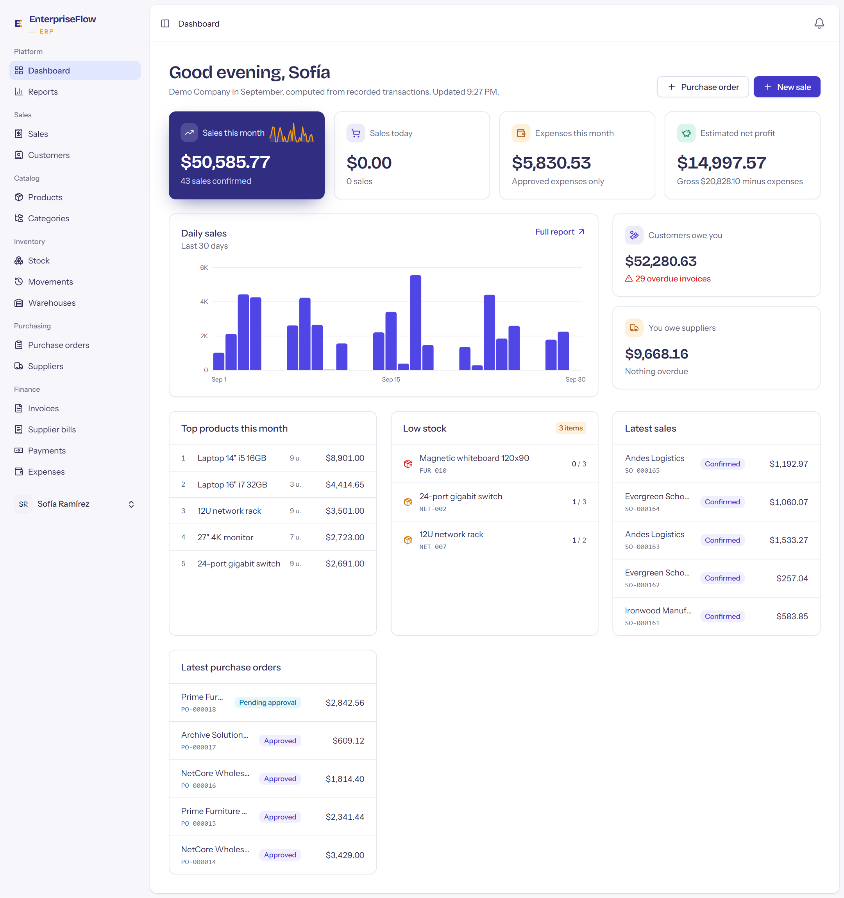

**Stack:** Laravel 12 · PHP 8.3 · PostgreSQL 16 · Redis 7 · Vue 3 + Inertia + TypeScript · Tailwind · Pest · Larastan · Docker · GitHub Actions · OpenAPI 3.1

---

## Contenido

- [Funcionalidades](#funcionalidades)
- [Capturas](#capturas)
- [Puesta en marcha](#puesta-en-marcha)
- [Usuarios demo](#usuarios-demo)
- [API REST](#api-rest)
- [Arquitectura y decisiones](#arquitectura-y-decisiones)
- [Calidad y tests](#calidad-y-tests)
- [Estructura del proyecto](#estructura-del-proyecto)

## Funcionalidades

| Módulo | Qué hace |
|---|---|
| **Multiempresa** | Una base de datos compartida con `company_id`, scope global *fail-closed* (sin empresa activa, las consultas lanzan excepción), claves foráneas compuestas `(company_id, id)` e identificadores de otra empresa que responden `404`. Selector de empresa en la web, header `X-Company-Id` en la API. |
| **Usuarios, roles y permisos** | Roles por empresa (7 plantillas de sistema + roles personalizados) sobre ~40 permisos `módulo.acción`. Invitaciones por email con token de un solo uso, suspensión de miembros, protección para no dejar una empresa sin Owner. |
| **Catálogo** | Productos simples y con variantes, categorías jerárquicas, imágenes, precios e impuestos en unidades mínimas (enteros, nunca `float`). |
| **Inventario** | Libro de movimientos **append-only** (bloqueado también con triggers en la base de datos) con saldo tras cada movimiento; proyección de stock por almacén con bloqueos en orden determinista; ajustes, transferencias, costo promedio ponderado y reconstrucción del stock a partir del libro. |
| **Compras** | Proveedores, órdenes con flujo de aprobación, recepciones parciales, facturas de proveedor validadas contra lo recibido. |
| **Ventas** | Clientes con notas, pedidos con descuentos e impuestos por línea, confirmación que descuenta stock de forma atómica y cancelación con movimientos compensatorios. |
| **Facturación y pagos** | Facturas con numeración sin huecos por empresa, PDF generado en cola, cobros y pagos parciales sin sobrepagos (fila bloqueada), anulación con historial, vencimientos automáticos. |
| **Gastos** | Registro con comprobante privado (validación de contenido real del archivo) y flujo de aprobación. |
| **Reportes** | 10 reportes (ventas, márgenes, compras, pérdidas y ganancias, antigüedad de cuentas por cobrar/pagar, valoración de inventario…) con exportación **CSV / Excel / PDF en segundo plano** y protección contra inyección de fórmulas. |
| **Dashboard** | Cifras reales calculadas de las transacciones, filtradas según los permisos de cada usuario. |
| **Auditoría** | Registro inmutable de quién cambió qué (solo los campos modificados, nunca secretos), en la misma transacción que el cambio. |
| **Notificaciones** | Campana y email: stock bajo, órdenes por aprobar, facturas vencidas, pagos recibidos, exportaciones listas, alertas de integraciones. Destinatarios por permiso y preferencias por usuario. |
| **API REST v1** | Tokens Sanctum, envoltorio uniforme `{success, data, message}`, errores centralizados, rate limiting y especificación **OpenAPI** generada del código. |
| **Webhooks entrantes** | Firma HMAC con marca de tiempo, idempotencia garantizada por la base de datos, procesamiento en cola con reintentos. |
| **Operación** | Docker (Nginx + PHP-FPM + colas con prioridades + scheduler), `GET /health`, logs JSON por canal (aplicación, colas, seguridad, auditoría). |

## Capturas

| | |
|---|---|
| 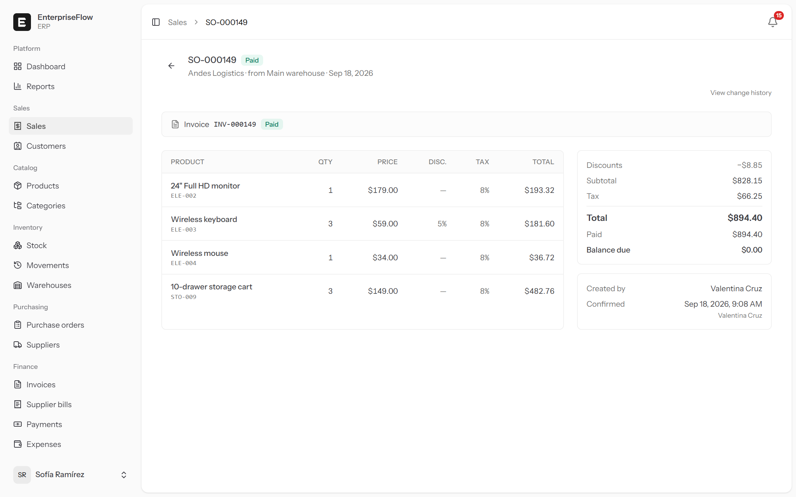 Venta con impuestos, descuentos y factura | 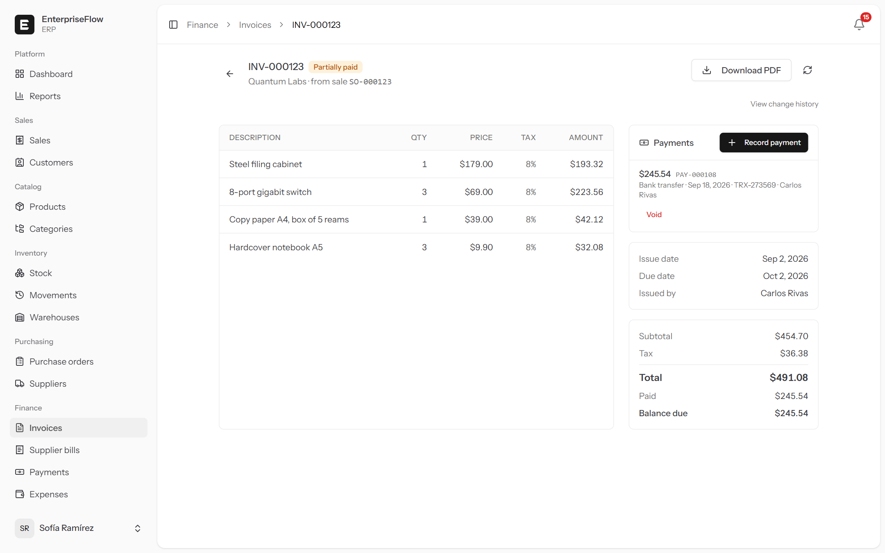 Factura con pagos parciales |
| 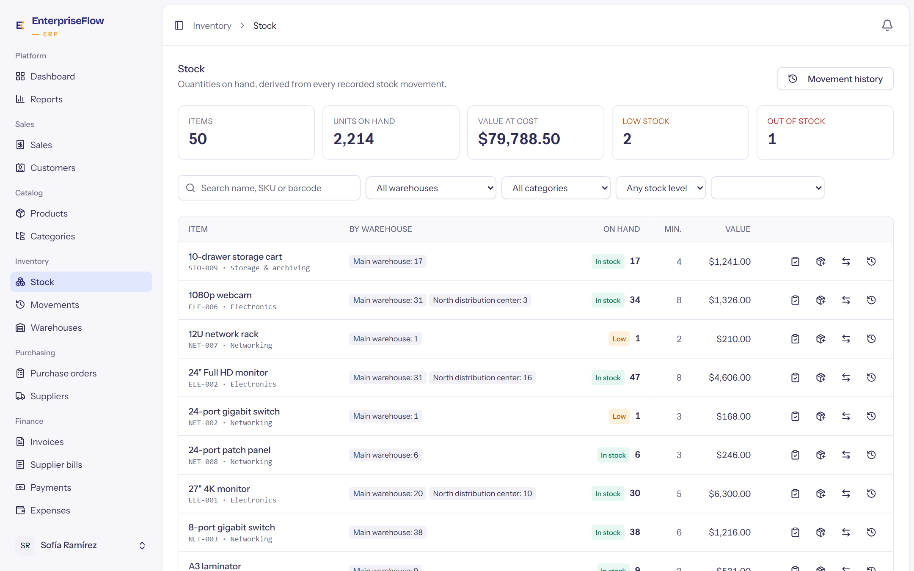 Stock por almacén | 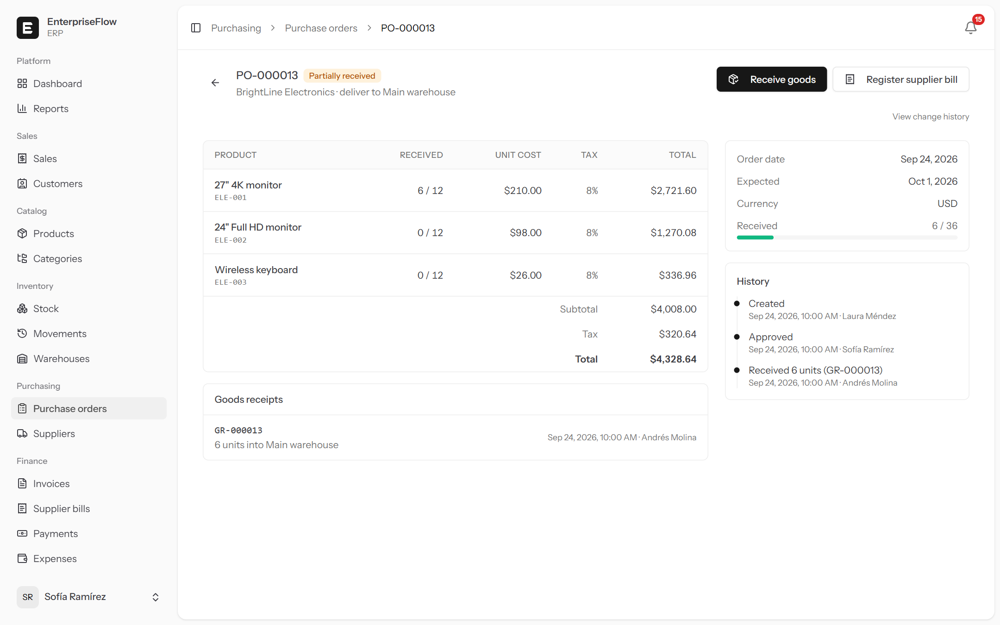 Orden de compra parcialmente recibida |
| 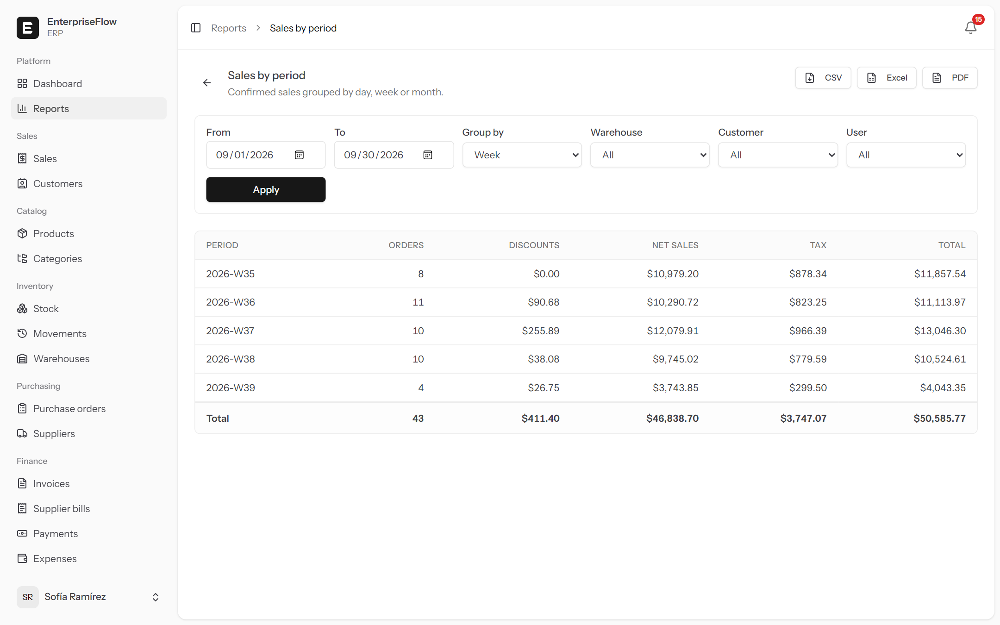 Reporte con exportación en segundo plano | 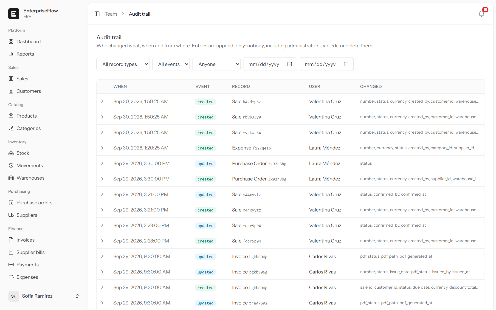 Auditoría con diff por campo |
| 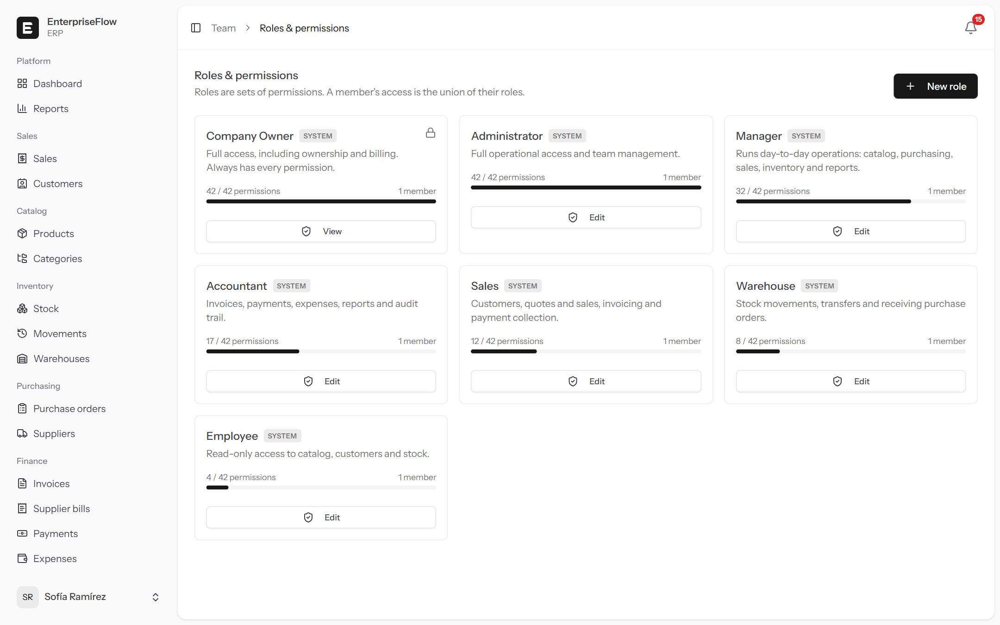 Roles y permisos por empresa | 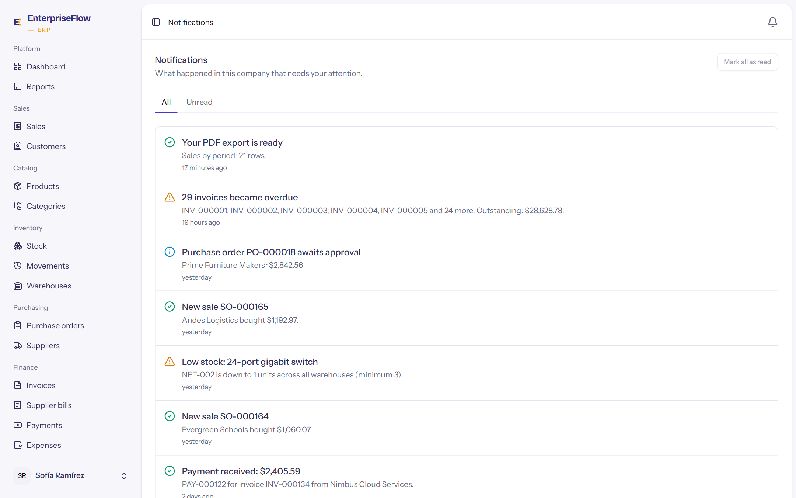 Centro de notificaciones |
| 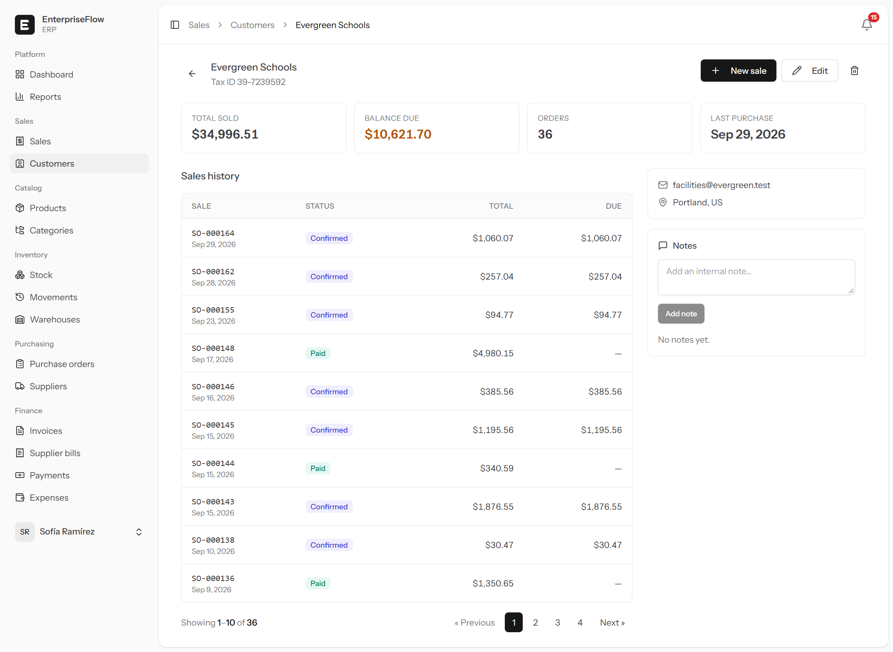 Ficha de cliente con saldo | 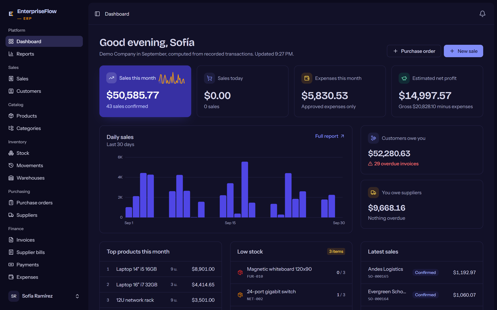 Modo oscuro |
| 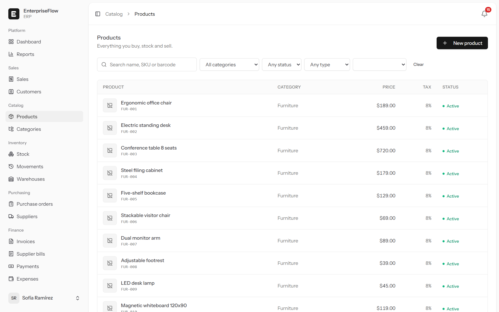 Catálogo | 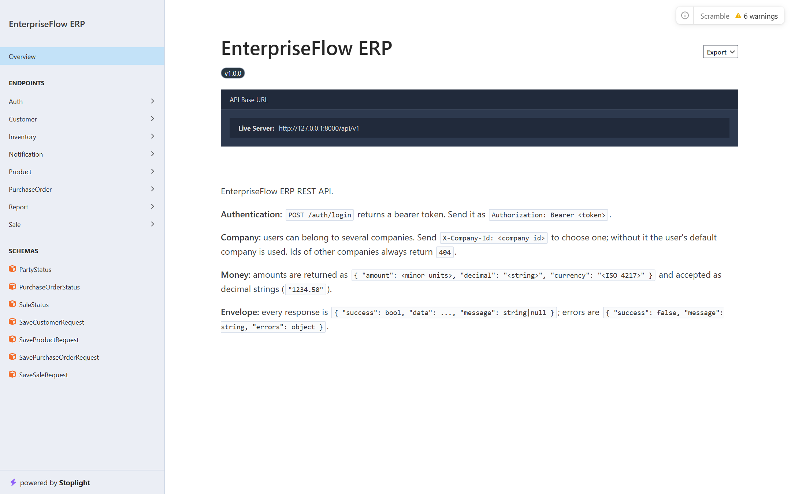 Documentación OpenAPI |

## Puesta en marcha

### Con Docker (recomendado)

Requisitos: Docker con Compose v2.

```bash
git clone https://github.com/dsebas28/EnterpriseFlow-ERP.git enterpriseflow && cd enterpriseflow
cp .env.example .env
docker compose run --rm --no-deps app php artisan key:generate --show   # copia el valor en APP_KEY de .env
docker compose up -d --build
```

| Servicio | URL |
|---|---|
| Aplicación | http://localhost:8080 |
| Documentación de la API | http://localhost:8080/docs/api (solo con `APP_ENV=local`) |
| Emails enviados (Mailpit) | http://localhost:8025 |
| Salud | http://localhost:8080/health |

El primer arranque migra la base de datos y carga la **empresa demo** (`SEED_DEMO=true`), lo que tarda alrededor de un minuto. Contenedores: `app` (PHP-FPM), `nginx`, `queue`, `scheduler`, `postgres`, `redis` y `mailpit`.

### Sin Docker

Requisitos: PHP 8.3 (`pdo_sqlite` o `pdo_pgsql`, `intl`, `gd`, `zip`, `bcmath`), Composer y Node 22.

```bash
composer install && npm ci
cp .env.example .env && php artisan key:generate
# Para usar SQLite: DB_CONNECTION=sqlite, QUEUE_CONNECTION=database, CACHE_STORE=database
php artisan migrate --seed
npm run build
composer dev        # servidor, cola, logs y Vite en paralelo
```

## Usuarios demo

La contraseña de todos es `password`. La demo simula cuatro meses de actividad de **Demo Company** (50 productos, 20 clientes, 10 proveedores, ~160 ventas con sus facturas y cobros, compras, gastos, transferencias) usando las mismas Actions que la aplicación, con numeración y fechas coherentes. El Owner también pertenece a **Andes Retail**, una segunda empresa, para probar el cambio de empresa y el aislamiento.

| Email | Rol | Qué puede hacer |
|---|---|---|
| `owner@demo.test` | Owner | Todo |
| `admin@demo.test` | Administrator | Todo excepto gestionar Owners |
| `manager@demo.test` | Manager | Operación completa: catálogo, inventario, compras, ventas, reportes |
| `accountant@demo.test` | Accountant | Facturas, pagos, gastos, reportes, auditoría |
| `sales@demo.test` | Sales | Clientes, ventas, facturas y cobros |
| `warehouse@demo.test` | Warehouse | Inventario y recepción de compras |
| `employee@demo.test` | Employee | Solo consulta: productos, clientes, inventario y ventas |

## API REST

Base: `/api/v1`. Especificación completa en `docs/openapi.json` y en `/docs/api`.

```bash
# 1. Token (se muestra una sola vez; en la base de datos solo se guarda su hash)
curl -s -X POST http://localhost:8080/api/v1/auth/login \
  -H 'Accept: application/json' -H 'Content-Type: application/json' \
  -d '{"email":"owner@demo.test","password":"password","device_name":"cli"}'

# 2. Peticiones con el token y la empresa elegida
curl -s http://localhost:8080/api/v1/products?search=monitor&sort=-price \
  -H "Authorization: Bearer $TOKEN" -H "X-Company-Id: $COMPANY_ID"
```

```json
{
  "success": true,
  "data": [{ "sku": "ELE-001", "name": "27\" 4K monitor", "price": { "amount": 38900, "decimal": "389.00", "currency": "USD" } }],
  "meta": { "current_page": 1, "per_page": 20, "total": 2, "last_page": 1 }
}
```

Endpoints: `auth/login`, `auth/logout`, `me`, `products` (CRUD), `customers`, `sales` (+ `confirm`, `cancel`), `purchases`, `inventory`, `reports`, `notifications`. Los errores siempre siguen `{ "success": false, "message": "…", "errors": {…} }` con los códigos 401, 403, 404, 422 (validación o regla de negocio), 429 y 500.

## Arquitectura y decisiones

El documento completo, con cada decisión justificada, está en **[docs/ARCHITECTURE.md](docs/ARCHITECTURE.md)**. En resumen:

- **Capas:** controladores delgados → Form Requests (validación y autorización) → **Actions** (un caso de uso por clase, transacción incluida) → modelos. Las mismas Actions sirven a la web, la API, los jobs, los webhooks y el seeder demo: cada regla de negocio existe una sola vez.
- **Tenancy fail-closed:** olvidar el contexto de empresa produce una excepción, nunca datos de otra empresa. Los jobs capturan la empresa al despacharse y la restauran en el worker.
- **Dinero exacto:** enteros en unidades mínimas por moneda (ISO 4217), redondeo *half-up* por línea y un único formato JSON `{amount, decimal, currency}`.
- **Concurrencia:** bloqueos de fila en stock, pagos, aprobaciones e invitaciones; numeración sin huecos con secuencias bloqueadas por empresa.
- **Historia inmutable:** el libro de inventario y la auditoría son append-only también a nivel de base de datos (triggers en PostgreSQL y SQLite); las correcciones son movimientos compensatorios.
- **Eventos después del commit:** notificaciones, PDFs y métricas nunca se disparan por una operación que terminó haciendo rollback.

## Calidad y tests

```bash
composer test            # 530+ tests en paralelo
composer test:coverage   # cobertura (requiere pcov o xdebug; mínimo 90 %)
composer test:arch       # reglas de arquitectura
composer ci              # Pint + Larastan + tests
npm run typecheck && npx eslint .
```

- **~96 % de cobertura de líneas**, en **SQLite y PostgreSQL** (CI ejecuta ambos).
- **Barridos de seguridad sobre las rutas registradas:** toda ruta exige autenticación salvo una lista pública revisada; un miembro sin roles recibe 403 en toda ruta con permisos; los registros de otra empresa responden 404 en **toda** ruta con model binding. Una ruta nueva queda cubierta sin escribir tests nuevos.
- **Reglas de arquitectura** (Pest arch): nada de `dd` ni funciones inseguras, `env()` solo en configuración, sin SQL en controladores, dominio sin dependencias HTTP, Actions `final`, DTOs `readonly`, eventos *after commit*.
- **Análisis estático** con Larastan nivel 6 y estilo con Pint; frontend con `vue-tsc`, ESLint y Prettier.
- **CI/CD (GitHub Actions):** calidad, frontend, tests en la matriz SQLite/PostgreSQL con umbral de cobertura, build de Docker con smoke test del stack completo y publicación de imágenes en GHCR desde `main`. Dependabot para dependencias.

## Estructura del proyecto

```
app/
├── Actions/           Casos de uso (una clase, una operación, una transacción)
├── Http/              Controladores web y API v1, Form Requests, Resources, middleware
├── Models/            Eloquent; los modelos de empresa usan BelongsToCompany
├── Policies/          Autorización por modelo
├── Queries/           Listados con filtros y orden por allow-list
├── Reports/           Definiciones de reportes y exportadores
├── Services/          Inventario, finanzas, permisos, notificaciones
├── Support/           Dinero, tenancy, API, webhooks, auditoría, salud
├── Jobs/ Events/ Listeners/ Notifications/ Webhooks/
database/              Migraciones (con triggers) y seeder demo
docker/                Nginx, PHP-FPM y entrypoint
docs/                  ARCHITECTURE.md, openapi.json y capturas
resources/js/          Vue 3 + TypeScript (páginas Inertia y componentes)
tests/                 Unit (dominio y arquitectura) y Feature (módulos y barridos)
```
