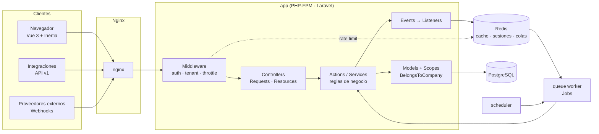
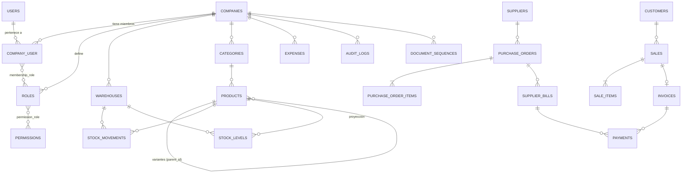
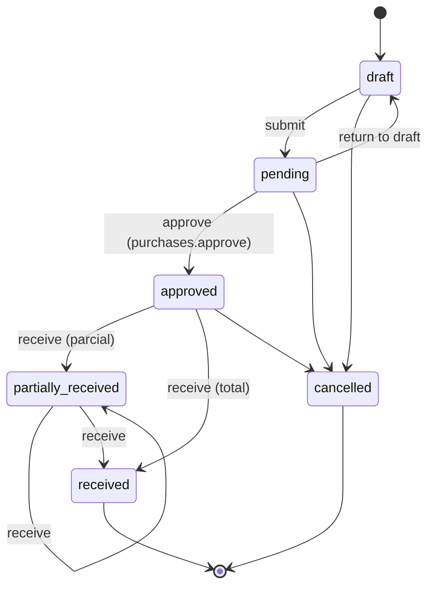
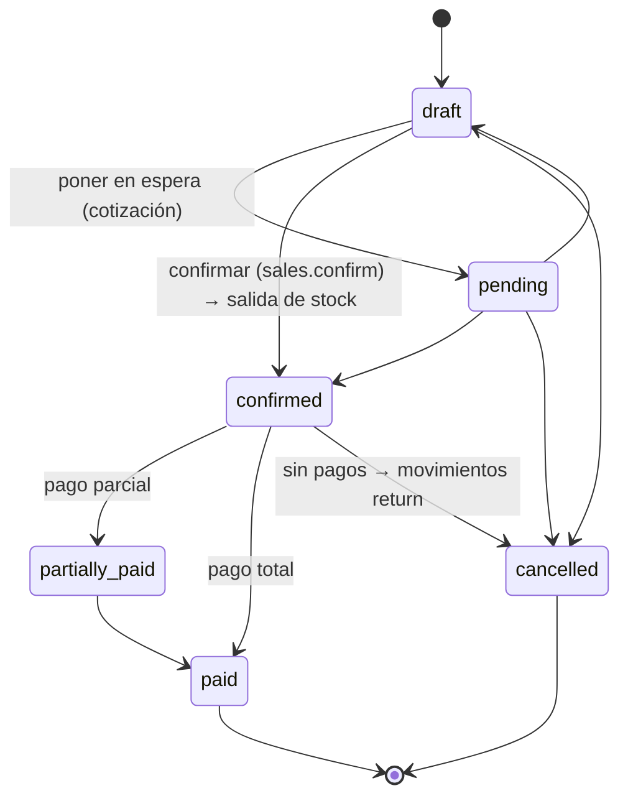

# EnterpriseFlow ERP — Arquitectura

> Documento vivo. Registra las decisiones técnicas y su justificación (estilo ADR ligero).
> Cada módulo nuevo añade o ajusta su sección aquí.

## 1. Visión general

EnterpriseFlow es un **monolito modular** Laravel que sirve dos interfaces sobre el mismo núcleo de dominio:

- **Web** (Inertia + Vue 3 + TypeScript): sesión con cookie, CSRF, SPA sin API pública.
- **API REST `/api/v1`** (Sanctum tokens): integraciones, apps móviles, automatizaciones.

Ambas interfaces son *adaptadores* delgados: validan la entrada (Form Requests), autorizan (Policies) y delegan en **Actions/Services**, que son las únicas que modifican estado de negocio.



## 2. Capas y responsabilidades

```text
app/
├── Actions/         Casos de uso atómicos (CreateSale, ReceivePurchaseOrder…). Una clase = una operación.
├── DTOs/            Datos de entrada tipados para Actions cuando un array no es suficientemente explícito.
├── Enums/           Estados y tipos (SaleStatus, StockMovementType, Permission…). Encapsulan transiciones válidas.
├── Events/          Hechos de dominio ya ocurridos (SaleConfirmed, StockBelowMinimum…).
├── Exceptions/      Excepciones de dominio (InsufficientStock, InvalidStateTransition…) → mapeadas a HTTP.
├── Http/
│   ├── Controllers/ Web/ (Inertia) y Api/V1/. Sin lógica de negocio.
│   ├── Middleware/  ResolveCurrentCompany, EnsureCompanyMember…
│   ├── Requests/    Validación + reglas tenant-aware.
│   └── Resources/   Serialización JSON estable para la API.
├── Jobs/            Trabajo asíncrono (PDF, reportes, emails, webhooks).
├── Listeners/       Reacciones a eventos (notificar, auditar, encolar).
├── Models/          Eloquent: relaciones, casts, scopes. Sin orquestación.
├── Notifications/   Canales database + mail.
├── Policies/        Autorización por modelo, siempre evaluada en backend.
├── Queries/         Query Objects de listados (búsqueda, filtros, orden por allow-list), compartidos por web y API.
├── Services/        Servicios reutilizables con estado o colaboradores (InventoryService, DocumentNumberGenerator…).
└── Support/         Infraestructura transversal (Tenancy/, Money/, Audit/, Api/…).
```

**Regla de oro:** un controlador hace `authorize → validate → action → respond`. Si un método de controlador supera ~15 líneas, falta una Action.

**Actions vs Services:** una *Action* es un caso de uso invocable (`handle()`), normalmente transaccional. Un *Service* agrupa operaciones de un subdominio que varias Actions reutilizan (p. ej. `InventoryService::move()` lo usan compras, ventas, devoluciones y ajustes).

## 3. Multi-tenancy

### 3.1 Estrategia: base de datos compartida con `company_id`

| Opción | Aislamiento | Coste operativo | Consultas cross-tenant (Super Admin, métricas) |
|---|---|---|---|
| **BD compartida + `company_id`** ✅ | Lógico (app + FKs) | Bajo: 1 esquema, 1 migración | Triviales |
| Esquema por tenant (PG schemas) | Medio | Migraciones × N | Complejas |
| BD por tenant | Fuerte | Alto (conexiones, backups × N) | Muy complejas |

Se elige BD compartida por simplicidad operativa, con **tres capas de defensa**:

1. **Global scope** (`BelongsToCompany` → `CompanyScope`): toda consulta Eloquent sobre un modelo tenant se filtra por la empresa activa, y `company_id` se asigna automáticamente al crear. Si no hay empresa activa en un contexto que la requiere, se lanza `MissingTenantContext` (fail-closed, nunca "devolver todo").
2. **Validación tenant-aware**: las reglas `exists`/`unique` de los Form Requests se restringen a la empresa activa, de modo que un ID de otra empresa se trata como inexistente (422/404, nunca 403 que revelaría existencia).
3. **Integridad en base de datos**: las relaciones entre entidades tenant usan **FKs compuestas** `(company_id, x_id) → x(company_id, id)`. Aunque un bug evitara las capas 1 y 2, PostgreSQL rechazaría una venta de la empresa A que apunte a un cliente de la empresa B.

### 3.2 Contexto de tenant

- `App\Support\Tenancy\TenantContext` — singleton por request/job con la empresa activa.
- **Web:** la empresa activa se guarda en sesión (`current_company_id`) y se cambia con un selector; el middleware verifica en cada request que el usuario siga siendo miembro activo.
- **API:** header `X-Company-Id` (o empresa por defecto del usuario); misma verificación de membresía.
- **Jobs:** los jobs tenant-aware serializan el `company_id` y restauran el contexto en `handle()` (trait `TenantAware`), porque el worker no tiene sesión.
- **Scheduler/CLI:** itera empresas explícitamente con `TenantContext::run($company, fn () => …)`.

### 3.3 Evolución a BD por tenant

`TenantContext` es el único punto que sabe *cuál* es la empresa activa. Para pasar a BD por tenant bastaría con: (a) un `TenantConnectionResolver` que cambie la conexión por defecto en `TenantContext::set()`, (b) mover las tablas tenant a una conexión `tenant`. Los IDs ULID de las entidades raíz evitan colisiones al separar/fusionar bases.

## 4. Identidad, roles y permisos

- **Super Admin:** flag de plataforma `users.is_super_admin`. `Gate::before` le concede todas las abilities, pero sigue necesitando membresía para *entrar* a una empresa. Nunca se asigna desde la UI de una empresa.
- **Membresía:** `company_user` (usuario ↔ empresa, con estado `active|suspended`). Un usuario puede pertenecer a varias empresas con roles distintos en cada una. Un administrador de empresa **suspende la membresía, no la cuenta**: la cuenta global (`users.status`) solo la gestiona la plataforma.
- **Roles por empresa:** al crearse, cada empresa recibe copias de los roles del sistema (`App\Enums\SystemRole`: Owner, Administrator, Manager, Accountant, Sales, Warehouse, Employee) y puede ajustar sus permisos o crear roles propios. `roles.company_id` + `unique(company_id, slug)`.
- **Permisos en código, roles en datos:** el enum `App\Enums\Permission` (`products.view`, `sales.cancel`…) es la fuente de verdad; no hay tabla `permissions` que sincronizar. `role_permissions(role_id, permission)` guarda la asignación y permite consultas como "¿quién puede cancelar ventas?". Nombres obsoletos se ignoran al resolver.
- **Owner implícito:** el rol Owner tiene *siempre* todos los permisos (no se almacenan), así un permiso nuevo nunca deja fuera al dueño. Es inmutable.
- **Integridad:** `membership_role(company_id, membership_id, role_id)` con FKs compuestas: la BD impide asignar a un miembro un rol de otra empresa.
- **Evaluación:** `PermissionResolver` (binding *scoped*) resuelve con **una consulta** la unión de permisos de los roles de la membresía activa y la memoiza por request. Cada permiso es una Gate (`can:sales.cancel`, `$user->can('sales.cancel')`). Las Policies combinan permiso + pertenencia del recurso + reglas de estado.
- **Reglas de protección del equipo** (`MembershipGuard`, en Actions para que web y API las compartan): nadie modifica su propia membresía; solo un Owner gestiona a otros Owners o concede ese rol; una empresa nunca se queda sin Owner activo. Violaciones → `BusinessRuleViolation` (422).
- El frontend recibe la lista de permisos solo para **ocultar** UI; nunca es fuente de autorización.

**¿Por qué no `spatie/laravel-permission`?** Es excelente, pero su modo *teams* añade configuración y cache global que habría que adaptar al tenant, y el modelo aquí es pequeño (3 tablas). Implementarlo permite controlar la resolución por tenant y las FKs compuestas. Se reconsiderará si aparecen permisos directos por usuario o jerarquías de roles.

### 4.1 Invitaciones

- Token aleatorio de 64 caracteres enviado por email; en BD solo se guarda su **SHA-256** (un volcado de la BD no permite aceptar invitaciones).
- Caducan a los 7 días, son de un solo uso (fila bloqueada con `lockForUpdate` al aceptar) y re-invitar revoca la invitación pendiente anterior.
- El email debe coincidir con el de la cuenta que acepta. Usuarios nuevos crean su cuenta desde el enlace (email verificado por el propio token).
- La notificación viaja por la cola con un *snapshot* de valores escalares, no con el modelo: los workers no tienen contexto de tenant.

### 4.2 Sesiones y cuenta

- Sesiones en driver `database` (el único que indexa sesiones por usuario): permite listar y revocar sesiones propias. Redis queda para cache y colas.
- Cambiar la contraseña cierra las demás sesiones; "cerrar otras sesiones" exige contraseña y rota el hash de *remember me*.
- Cuentas inactivas: el login falla con el mismo mensaje que credenciales inválidas (no revela estado) y las sesiones/tokens activos se cortan en el siguiente request.
- Eventos de autenticación (login, fallo, bloqueo, logout, reset, cambio de empresa, acceso denegado a tenant) → canal `security` vía `SecurityLogger`, con usuario, empresa, IP y user agent.

## 5. Modelo de datos

Convenciones:
- **ULID** como PK en entidades raíz expuestas por URL/API (`companies`, `products`, `customers`, `suppliers`, `warehouses`, `sales`, `purchase_orders`, `invoices`, `payments`, `expenses`): no enumerables, ordenables por tiempo y seguros para una futura separación de bases.
- **bigint** en tablas internas de alto volumen (líneas, movimientos, auditoría, pivotes) y en `users`.
- **Dinero:** `bigint` en unidades menores (centavos) + cast `Money`. Nunca `float`. La moneda es la de la empresa.
- **Impuestos:** en *basis points* (`1900` = 19 %).
- **Cantidades:** `integer` (unidades). Unidades fraccionarias (kg, m) quedan en el roadmap.
- **Soft deletes** solo en catálogos (productos, clientes, proveedores, almacenes, categorías). Los documentos financieros **no se borran**: se cancelan/anulan con motivo.



Tablas de soporte: `document_sequences` (numeración sin huecos por empresa y tipo), `invitations`, `audit_logs`, `webhook_events`, `report_exports` (estado de exportaciones asíncronas), `notifications`, `jobs`, `failed_jobs`, `personal_access_tokens`.

### 5.1 Catálogo y dinero

- **`Money` (value object):** entero en unidades menores + moneda. Se construye desde strings decimales (`"123.45"`) sin pasar por `float`; los decimales dependen de la moneda (ISO 4217: COP/USD 2, CLP/JPY 0, KWD 3). Los porcentajes (impuestos, descuentos) usan *basis points* y redondeo half-up en aritmética entera.
- **Formato JSON uniforme** para importes en web y API: `{ "amount": 7990000, "decimal": "79900.00", "currency": "COP" }`. El cliente solo formatea con `Intl`; nunca recalcula.
- **Variantes:** `products.type ∈ {simple, variable, variant}`. Un producto `variable` es una plantilla sin stock; sus variantes (`parent_id`) son los artículos vendibles. Un solo nivel. El tipo es inmutable tras crearse. Categoría e impuesto se heredan del padre; la combinación de atributos es única entre hermanas (sin importar el orden).
- **Identificadores:** SKU y código de barras únicos **por empresa** (índice compuesto), normalizados antes de validar para que la validación coincida exactamente con el índice. El SKU de un producto borrado queda reservado.
- **Categorías:** árbol (`parent_id` con FK compuesta), sin ciclos; filtrar por una categoría incluye sus descendientes. No se borran con productos o subcategorías.
- **Almacenes:** cada empresa nace con un almacén `MAIN`. "Un solo almacén por defecto por empresa" es un **índice único parcial** (`WHERE is_default AND deleted_at IS NULL`), válido en PostgreSQL y SQLite.
- **Imágenes:** validación por contenido (MIME real, no extensión), sin SVG, ≤ 2 MB y ≤ 4000 px; nombre aleatorio bajo `companies/{company_id}/products/{product_id}/`; máximo 8 por producto. Las imágenes de producto son públicas; documentos sensibles (facturas, comprobantes) irán en un disco privado.
- **Listados:** Query Objects (`app/Queries`) con búsqueda, filtros y ordenación por *allow-list*, reutilizados por la web y la API.

## 6. Inventario basado en movimientos

- `stock_movements` es un **ledger append-only**: cada fila registra producto, almacén, cantidad con signo, tipo, costo unitario, usuario, referencia polimórfica, fecha, observaciones y `balance_after` (saldo resultante, para el kardex sin recalcular). Se protege en **dos capas**: el modelo lanza excepción en `updating/deleting` y la base de datos tiene **triggers** (`BEFORE UPDATE OR DELETE`, PL/pgSQL en PostgreSQL y `RAISE(ABORT)` en SQLite) que rechazan incluso SQL crudo. Los errores se corrigen con movimientos compensatorios.
- `stock_levels(product_id, warehouse_id, quantity)` es una **proyección** para lecturas rápidas, actualizada *en la misma transacción* que el movimiento por `InventoryService`, el único escritor de stock.
- **Concurrencia:** la fila de la proyección se crea con `insertOrIgnore` (sin carrera al crearla) y se bloquea con `SELECT … FOR UPDATE` antes de validar disponibilidad → dos ventas simultáneas de la última unidad se serializan y la segunda falla con `InsufficientStock` (422). Los documentos con varias líneas bloquean filas en **orden determinista** (almacén, producto) para evitar deadlocks.
- **Atomicidad:** `recordMany()` aplica todas las líneas o ninguna. Los eventos (`StockMovementRecorded`, `StockFellBelowMinimum`) implementan `ShouldDispatchAfterCommit`: nunca se notifica un movimiento revertido. `StockFellBelowMinimum` se dispara solo al *cruzar* el mínimo.
- **Reglas:** cada tipo define su signo (compra solo entra, venta solo sale; ajuste, devolución y transferencia en ambos sentidos). Stock negativo prohibido salvo `companies.settings.allow_negative_stock`. Productos `variable` y almacenes inactivos no mueven stock. No se borra un producto ni un almacén con stock.
- **Operaciones manuales:** ajuste por conteo físico (se registra la diferencia, leyendo el saldo bajo bloqueo), entrada/salida manual con motivo obligatorio, y transferencia = dos movimientos enlazados por `transfer_id` en una transacción.
- **Referencias polimórficas** con `Relation::enforceMorphMap`: la BD guarda alias estables (`sale`, `purchase_order`) y nunca nombres de clase PHP.
- `php artisan inventory:rebuild [--company=] [--fix]` recalcula la proyección desde el ledger, reporta discrepancias (log `app_json`) y devuelve código de salida ≠ 0 en *dry run* si las hay, apto para monitorización programada.
- **Valoración:** a costo estándar (costo actual del producto). El costo promedio ponderado por movimiento queda en el roadmap.

## 7. Flujos transaccionales

Toda operación que toca más de una tabla de negocio corre en `DB::transaction()` dentro de su Action. Los efectos secundarios (emails, notificaciones, PDFs) se disparan con eventos **después del commit** (`ShouldDispatchAfterCommit` / `afterCommit()`), para no notificar algo que se revirtió.

- **Compra:** `draft → pending → approved → partially_received → received` (o `cancelled` antes de recibir; `pending → draft` para devolver a corrección). Detalle en §7.1.
- **Venta:** `draft → pending → confirmed → partially_paid → paid` (o `cancelled`). Detalle en §7.2.
- Las transiciones válidas viven en los Enums (`PurchaseOrderStatus::allowedTransitions()`); una transición inválida lanza `InvalidStateTransition` (422). Cada transición relee el documento con `lockForUpdate`, así dos aprobadores simultáneos no pueden aprobar dos veces.

### 7.1 Compras



- **Numeración sin huecos** (`DocumentNumberGenerator`): una fila por empresa y tipo en `document_sequences`, bloqueada con `FOR UPDATE` y generada *dentro* de la transacción del documento → sin duplicados bajo concurrencia y sin huecos si la transacción se revierte. Lanza excepción si se llama fuera de una transacción.
- **Totales en servidor** (`LineCalculator`): impuesto calculado y redondeado por línea (half-up) y sumado; los totales enviados por el cliente se ignoran. Soporta descuentos para ventas.
- **Snapshots:** cada línea guarda descripción, costo e impuesto; el documento guarda la moneda. Cambiar el producto después no altera documentos emitidos.
- **Solo borradores se editan o eliminan**; después, un documento se cancela con motivo obligatorio (queda en el historial).
- **Recepción** (`ReceivePurchaseOrder`), en una transacción: bloquea la orden, valida `cantidad ≤ pendiente` por línea, crea el albarán (`GR-…`), registra movimientos `purchase` con `unit_cost` y referencia al albarán, actualiza cantidades recibidas y el estado. Si una línea falla, no queda nada.
- **Costo promedio ponderado móvil** (`WeightedAverageCost`): `(existencias × costo actual + recibido × costo recibido) / total`, recalculado en cada recepción (considera líneas repetidas del mismo producto en un albarán).
- Facturas de proveedor y pagos (cuentas por pagar) se implementan con el módulo de facturación y pagos, compartido con ventas.

### 7.2 Ventas



- **Confirmar** (`ConfirmSale`), en una transacción: bloquea la venta (no hay doble confirmación), descuenta todas las líneas con `InventoryService::recordMany()` (filas de stock bloqueadas en orden determinista), guarda `unit_cost` por línea (costo real del momento, para reportes de utilidad) y emite `SaleConfirmed` tras el commit. Si una línea no tiene stock, la venta queda en su estado anterior y no existe ningún movimiento.
- **Cancelar** (`CancelSale`): motivo obligatorio. Si el stock ya había salido, vuelve con movimientos `return` que referencian la venta y conservan el costo: el kardex muestra la venta *y* su reverso. Una venta con pagos no se cancela (requiere reembolso).
- **Descuentos por línea** en *basis points* antes de impuestos; precio sugerido desde el producto y editable (snapshot).
- **Saldo del cliente** = Σ (`total − amount_paid`) de ventas `confirmed`/`partially_paid`, calculado en SQL (`withSum`) para el listado. `amount_paid` lo mantiene el módulo de pagos.
- **Ficha de cliente:** historial de ventas, total vendido, saldo pendiente, última compra y notas internas (borrables por su autor o por quien puede editar el cliente).

### 7.3 Facturación (cuentas por cobrar y por pagar)

Ambos documentos comparten `InvoiceStatus`: `draft → issued → partially_paid → paid`, con `overdue` (calculado) y `cancelled`.

**Facturas de cliente**
- Se crean como borrador desde una venta confirmada, copiando sus líneas (snapshot). **El número legal (`INV-…`) y la fecha de emisión se asignan al emitir**, no al crear: los borradores descartados no consumen numeración.
- **Una factura vigente por venta**, garantizado por un índice único parcial `(company_id, sale_id) WHERE status <> 'cancelled'`. Anular (motivo obligatorio, sin pagos) conserva el número y permite refacturar.
- **Vencidas:** `invoices:mark-overdue` compara `due_date` con la fecha de hoy *en la zona horaria de cada empresa*; idempotente, pensado para el scheduler diario.
- **PDF asíncrono:** al emitir se encola `GenerateInvoicePdf` (cola `documents`, 3 intentos con backoff) *después del commit*. El archivo va a un **disco privado** y se descarga por una ruta que autoriza (`view`) antes de servir el stream. `pdf_status` (`pending → ready | failed`) permite a la UI consultar el progreso; `failed()` marca el error y lo registra en el canal `queue`.

**Facturas de proveedor**
- Se registran desde una orden de compra y solo por lo **recibido y aún no facturado** (`received − billed` por línea): *two-way match* recepción ↔ factura, a costo pactado en la orden.
- **Anti-duplicados:** el número de factura del proveedor es único por proveedor (índice parcial que excluye anuladas).
- Anular libera las cantidades facturadas para registrar la factura correcta.

### 7.4 Pagos

- **Un módulo, dos direcciones:** `incoming` (cobro de una factura) y `outgoing` (pago de una factura de proveedor). En lugar de un `morphTo`, el pago tiene dos FKs anulables (`invoice_id`, `supplier_bill_id`) con claves compuestas por empresa: la BD sigue impidiendo que un pago apunte a un documento de otra empresa.
- **Sin sobrepagos, incluso en concurrencia:** `RecordPayment` bloquea el documento (`FOR UPDATE`) y valida `importe ≤ saldo` con el saldo releído bajo el bloqueo.
- **`amount_paid` = Σ pagos `posted`**, recalculado desde el historial en cada registro o anulación (`Settlement`), nunca sumado o restado en sitio: no puede desincronizarse del historial.
- **Estados de pago derivados de importes** (`InvoiceStatus::fromSettlement`): `paid` si el saldo es 0; si no, `overdue` si ya venció o `partially_paid`. No son transiciones de usuario, así que anular un pago devuelve el documento al estado correcto sin reglas especiales. La venta refleja los pagos de su factura (`amount_paid`, `confirmed → partially_paid → paid`).
- **Inmutables:** un pago registrado no se edita ni se borra (el modelo lo impide). Solo se **anula** con motivo, usuario y fecha; sigue visible en el historial y en los listados (tachado).
- `PaymentReceived` se emite tras el commit (notificaciones, fase 16).

### 7.5 Jobs con contexto de tenant

Los workers no tienen sesión, así que un job debe saber para qué empresa trabaja:
- El trait `TenantAware` captura `company_id` del `TenantContext` al crear el job y declara el *job middleware* `RestoreTenantContext`, que ejecuta `handle()` dentro de `TenantContext::run($company)`.
- **Los jobs guardan IDs, no modelos:** `SerializesModels` rehidrata los modelos *antes* de que corra el middleware, cuando aún no hay empresa activa, y el scope fail-closed rechazaría la consulta.
- `failed()` se ejecuta fuera del pipeline de middleware; el trait ofrece `inTenant()` para ese caso.
- Las notificaciones encoladas usan el mismo principio (snapshot de valores escalares, ver §4.1).

### 7.6 Gastos

- Flujo `pending → approved | rejected` con **segregación de funciones**: el autor nunca aprueba su propio gasto. Solo los pendientes se editan o eliminan.
- Comprobantes validados por **contenido real** (PDF/imagen; un test usa un `UploadedFile` real porque `UploadedFile::fake()` deduce el MIME por el nombre) y guardados en disco privado, descargables vía ruta autorizada. Si la escritura en BD falla, el archivo subido se elimina (sin huérfanos).

### 7.7 Reportes y exportaciones

- **Contrato `Report`** (columnas tipadas `text|number|money|percent`, filtros admitidos, filas, totales) + `ReportRegistry`. La pantalla, las exportaciones y la API consumen la misma definición: un número tiene una sola fuente.
- 10 reportes: ventas por período/producto/cliente, compras por período, gastos por categoría, **pérdidas y ganancias** (ventas netas − costo de lo vendido con el `unit_cost` capturado en cada línea − gastos aprobados), antigüedad de saldos por cobrar/pagar (corriente, 1–30, 31–60, 61–90, 90+), valoración de inventario y stock bajo.
- Agrupación día/semana/mes con SQL específico por motor aislado en `DateBucket` (`strftime` / `to_char`).
- Filtros validados contra la empresa activa: un id de otro tenant es un error de validación.
- **Exportaciones asíncronas** (`report_exports`: `pending → processing → completed | failed`, cola `reports`): CSV nativo con BOM UTF-8, XLSX en streaming (`openspout`, memoria constante) y PDF (dompdf, máx. 2.000 filas). Privadas para quien las solicitó; la UI consulta el estado.
- **Inyección de fórmulas CSV/Excel neutralizada**: celdas de texto que empiezan por `= + - @` se prefijan con `'`.

### 7.8 Dashboard

- Cifras reales reutilizando las definiciones de reportes (ventas hoy/mes, gráfico diario de 30 días, top productos, gastos, utilidad estimada, cuentas por cobrar/pagar con vencidas, stock bajo, últimas ventas y compras).
- **Cacheado 60 s por empresa y día** (`Cache::remember`, Redis en producción): la página más visitada no recalcula agregados en cada carga.
- **Las secciones se filtran por permiso en el servidor**: un empleado sin `reports.view` no recibe las cifras financieras en las props (ocultarlas solo en la UI las filtraría igualmente).
- Gráfico SVG propio sin dependencias, siguiendo una guía de visualización: una sola serie en un tono validado para contraste y daltonismo (pasos distintos en claro/oscuro), columnas finas con extremo redondeado y separación de 2 px, cuadrícula recesiva, tooltip con área de hover mayor que la marca y tabla accesible para lectores de pantalla.

## 8. Auditoría

- **`audit_logs` append-only**, protegida como el ledger de stock: el modelo lanza excepción en `updating/deleting` y **triggers** (PostgreSQL y SQLite) rechazan `UPDATE`/`DELETE` incluso con SQL crudo. Un registro de auditoría editable no prueba nada.
- **Trait `Auditable`** en los modelos sensibles (empresa, productos, categorías, almacenes, clientes, proveedores, ventas, órdenes de compra, facturas, facturas de proveedor, pagos, gastos, roles): registra `created`, `updated`, `deleted`, `restored` con **solo los campos modificados** (antes → después). Nunca guarda `password`, `remember_token`, `token_hash` ni timestamps; un `touch()` no genera entrada.
- **Eventos explícitos** para cambios que no son atributos del modelo: `role.permissions_changed` (permisos añadidos/quitados), `member.roles_changed`, `member.suspended`, `member.reactivated`, `invitation.sent`.
- **Contexto completo**: usuario, empresa, IP, user agent, método y URL; en colas/consola el usuario queda vacío (acción del sistema) y la URL `console`.
- **Misma transacción que el cambio**: si la operación se revierte, su auditoría también (nunca se registra algo que no ocurrió).
- **Consulta**: página *Audit trail* (`audit.view`) con filtros por tipo de registro, id, evento, usuario y fechas, y diff campo a campo; enlaces "View change history" desde productos, ventas, facturas y órdenes de compra. Filtrada por empresa (scope fail-closed).
- Se replica en el canal de log `audit` (JSON, retención 365 días), separado de aplicación, colas y seguridad.
- El ledger de stock no se audita de nuevo: ya es su propio registro inmutable con usuario, fecha y referencia.

## 9. Asíncrono: colas, scheduler y webhooks

- **Redis** como backend de colas con colas separadas: `default`, `notifications`, `reports`, `webhooks`.
- Exportaciones/PDFs: el request crea un `report_exports` en estado `pending`, encola el Job y la UI consulta el estado (`processing → completed|failed`).
- **Scheduler:** facturas vencidas, stock bajo, recordatorios, poda de sesiones/tokens, reportes periódicos.
- **Webhooks entrantes:** verificación HMAC con comparación en tiempo constante y ventana de timestamp → persistencia en `webhook_events` con `unique(provider, external_id)` (idempotencia garantizada por la BD) → respuesta `202` inmediata → procesamiento en Job con reintentos y backoff.

## 10. API

- **Versionada por prefijo** `/api/v1` (`routes/api.php`), controladores delgados en `Http/Controllers/Api/V1`. Reutilizan exactamente las mismas Actions, Form Requests, Policies, Query Objects, Resources y definiciones de reportes que la web: una regla de negocio existe una sola vez.
- **Autenticación:** `POST /auth/login` (email, password, `device_name`) devuelve un token personal de Sanctum **una sola vez** (en BD solo su hash), con expiración configurable (`SANCTUM_TOKEN_EXPIRATION`, 30 días por defecto). Credenciales inválidas y cuentas desactivadas producen el mismo error (sin enumeración de usuarios). `POST /auth/logout` revoca el token actual; `GET /me` devuelve el usuario y sus empresas. Un usuario desactivado pierde el acceso aunque conserve tokens.
- **Empresa activa:** header `X-Company-Id`. Si falta, se usa la primera empresa activa del usuario; si apunta a una empresa ajena → `403` y evento en el canal `security`. Los registros de otra empresa responden `404` (el scope global los hace invisibles).
- **Envoltorio uniforme** (`App\Support\Api\ApiResponse`): `{ success, data, message, meta? }`; `meta` = `{ current_page, per_page, total, last_page }` en listados paginados.
- **Errores centralizados** (`ApiExceptionRenderer`, solo rutas `api/*`; `ForceJsonResponse` garantiza JSON): `{ success: false, message, errors }`.

  | Situación | Código |
  |---|---|
  | Validación | 422 (`errors.campo[]`) |
  | Regla de negocio (`BusinessRuleViolation`) | 422 (`errors.rule[]`) |
  | Sin token / token inválido | 401 |
  | Sin permiso, cuenta inactiva, empresa ajena | 403 |
  | Recurso inexistente o de otra empresa | 404 |
  | Rate limit | 429 (+ `Retry-After`) |
  | Error inesperado | 500 (mensaje genérico salvo en debug; se registra) |

- **Listados:** paginación, filtros, búsqueda y ordenación por *allow-list* validadas (`sort=-price`, `per_page` acotado); nunca columnas arbitrarias del cliente.
- **Rate limiting:** `api` 60 req/min por usuario (o IP); `api-login` 5/min por email+IP y 20/min por IP.
- **Endpoints v1:** `products` (CRUD), `customers` (index/store/show), `sales` (index/store/show, `confirm`, `cancel`; `"confirm": true` crea y confirma en una llamada), `purchases` (index/store/show), `inventory` (stock por producto/almacén), `reports` (catálogo), `reports/sales` y `reports/{key}`.
- **OpenAPI 3.1** inferido del código con `dedoc/scramble` (Form Requests, Resources, docblocks): UI en `/docs/api` (restringida fuera de `local`) y especificación versionada en `docs/openapi.json` (`php artisan scramble:export`). `TenantRule` resuelve la empresa de forma perezosa —al validar, no al construir la regla— para que el generador lea las reglas sin tenant sin relajar el *fail-closed*.

## 11. Observabilidad

- Canales de log separados, JSON por línea con contexto (`company_id`, `user_id`, IP): `app_json` (aplicación), `queue` (jobs y exportaciones), `security` (autenticación, accesos denegados, cambios de empresa; 90 días) y `audit` (cambios de datos; 365 días).
- `GET /health` comprueba aplicación, base de datos y Redis y devuelve `200` o `503` con detalle por componente.

## 12. Entornos y verificación

| Entorno | Base de datos | Cache/colas | Uso |
|---|---|---|---|
| Docker Compose | PostgreSQL 16 | Redis 7 | Desarrollo y demo |
| Tests locales | SQLite en memoria | array / sync | Feedback rápido |
| CI (GitHub Actions) | PostgreSQL 16 (service) | Redis 7 (service) | Garantiza compatibilidad con producción |

El código evita SQL específico de un motor salvo donde se justifica (p. ej. `lockForUpdate`, que en SQLite es un no-op seguro porque SQLite serializa escrituras).

## 13. Dependencias externas

Se añade una librería solo cuando Laravel no cubre la necesidad:

| Paquete | Motivo |
|---|---|
| `laravel/sanctum` | Tokens de API y SPA auth (first-party). |
| `pestphp/pest` | Tests más expresivos sobre PHPUnit. |
| `larastan/larastan` | Análisis estático consciente de Eloquent. |
| `barryvdh/laravel-dompdf` | Laravel no genera PDF; se usa solo dentro de un job en cola. |
| `openspout/openspout` | XLSX en streaming con memoria constante (más ligero que maatwebsite/excel); CSV se hace nativo. |
| `dedoc/scramble` | OpenAPI inferido del código (Form Requests, Resources), sin anotaciones duplicadas que se desincronicen. |

## 14. Plan incremental

1. ✅ Arquitectura y fundaciones (este documento, tooling, logging)
2. ✅ Base de datos núcleo + multi-tenancy
3. ✅ Autenticación (sesiones, invitaciones, desactivación)
4. ✅ Roles y permisos
5. ✅ Productos, categorías, variantes, almacenes
6. ✅ Inventario (ledger + proyección)
7. ✅ Compras (proveedores, órdenes, aprobación, recepciones)
8. ✅ Ventas (clientes, notas, confirmación con stock, cancelación compensatoria)
9. ✅ Facturación (clientes con PDF asíncrono, proveedores con two-way match)
10. ✅ Pagos (cobros y pagos, sin sobrepagos, anulación con historial)
11. ✅ Gastos, reportes con exportación y dashboard con datos reales
12. ✅ Auditoría
13. ✅ API v1 + OpenAPI
14. Jobs/colas, notificaciones, scheduler, webhooks
15. Docker, CI/CD, documentación final
