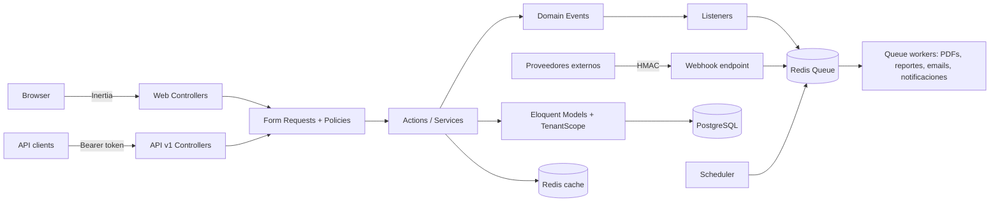
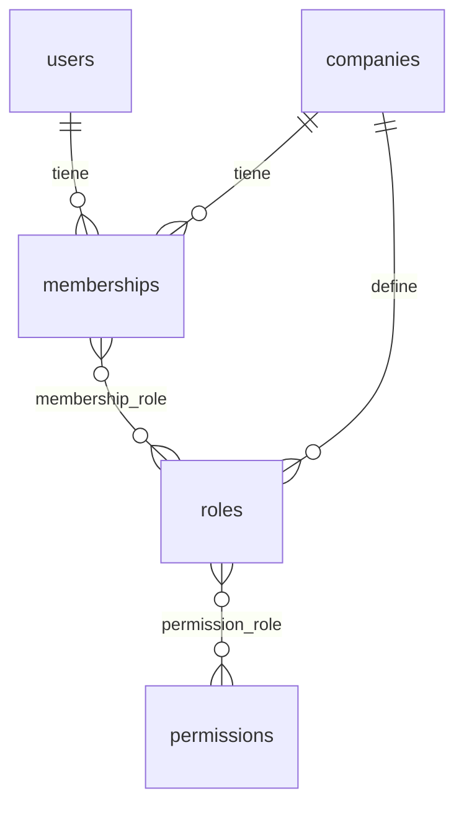
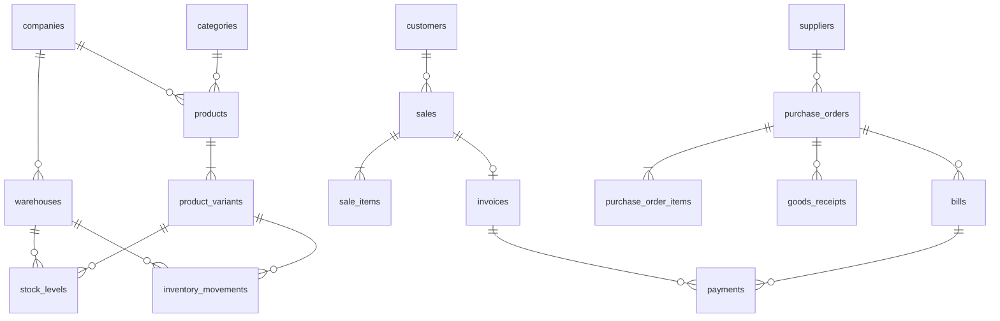

# EnterpriseFlow ERP — Arquitectura

> Documento de decisiones técnicas. Se actualiza a medida que se implementa cada módulo.
> Estado: **Fase 1 — Análisis de arquitectura**

---

## 1. Visión general

EnterpriseFlow ERP es un monolito modular Laravel servido en dos superficies:

- **Web (Inertia + Vue 3 + TypeScript)**: sesión con cookie, CSRF, SPA sin API pública intermedia.
- **API REST `/api/v1`**: tokens Sanctum, pensada para integraciones y apps móviles.

Ambas superficies llaman a la **misma capa de aplicación** (Actions/Services). Los controllers solo traducen HTTP ↔ dominio.



### Principios

1. **Controllers delgados**: validan (FormRequest), autorizan (Policy), delegan a una Action, devuelven Resource/Inertia.
2. **Una Action = un caso de uso** (`CreateSale`, `ConfirmSale`, `ReceivePurchaseOrder`). Services para lógica reutilizada por varias Actions (`StockService`, `DocumentNumberService`).
3. **Integridad en la base de datos**, no solo en PHP: FKs, uniques, checks y transacciones.
4. **Fail closed**: si no hay tenant resuelto, las consultas a modelos de tenant fallan en vez de devolver todo.
5. **Sin dependencias innecesarias**: se usa lo que Laravel trae; cada paquete externo se justifica (ver §10).

---

## 2. Estructura de carpetas

```text
app/
├── Actions/            # Casos de uso: Sales/CreateSale.php, Purchases/ReceivePurchaseOrder.php …
├── DTOs/               # Datos tipados entre HTTP y Actions (SaleData, SaleItemData)
├── Enums/              # SaleStatus, InvoiceStatus, MovementType, PaymentMethod, Permission …
├── Events/             # SaleConfirmed, StockBelowMinimum, PaymentReceived …
├── Exceptions/         # InsufficientStockException, InvalidStateTransition, TenantNotResolved …
├── Http/
│   ├── Controllers/
│   │   ├── Web/        # Inertia
│   │   └── Api/V1/     # JSON
│   ├── Middleware/     # ResolveTenant, EnsureActiveMembership, AssignRequestId
│   ├── Requests/
│   └── Resources/      # API Resources (también usados para props de Inertia)
├── Jobs/
├── Listeners/
├── Models/
│   └── Concerns/       # BelongsToCompany, Auditable, HasPublicId
├── Notifications/
├── Policies/
├── Services/           # StockService, DocumentNumberService, ReportService …
└── Support/
    ├── Tenancy/        # TenantContext, TenantScope, TenantResolver
    ├── Api/            # ApiResponse, QueryFilters (filtros/sorting con allowlist)
    └── Money/          # Money value object
```

No se usan "repositories" sobre Eloquent: añadirían una capa sin valor en este contexto. Las consultas complejas de lectura (reportes, dashboard) viven en clases `Queries/` dedicadas cuando crezcan.

---

## 3. Multi-tenancy

### Estrategia: base de datos compartida + `company_id`

| Opción | Aislamiento | Coste operativo | Elección |
|---|---|---|---|
| BD compartida + `company_id` | Lógico (scopes + FKs compuestas) | Bajo | ✅ Ahora |
| Schema por tenant (PostgreSQL) | Fuerte | Medio | Evolución posible |
| BD por tenant | Máximo | Alto | Evolución posible |

### Componentes

- **`TenantContext`** (singleton): única fuente de verdad de la empresa activa. Nadie lee `company_id` de la sesión o del request directamente.
- **`ResolveTenant` middleware**:
  - Web: empresa activa guardada en sesión; el usuario la cambia con un selector.
  - API: la empresa va ligada al **token** Sanctum (columna `company_id` en `personal_access_tokens`), no a un header que el cliente pueda manipular.
  - En ambos casos se verifica que el usuario tenga una **membresía activa** en esa empresa.
- **`BelongsToCompany` trait**: añade `TenantScope` (global scope) y asigna `company_id` automáticamente al crear. Si falta el contexto lanza `TenantNotResolved` (fail closed).
- **Route model binding** pasa por el scope ⇒ un recurso de otra empresa devuelve **404**, no 403 (no revela que existe).
- **Jobs**: guardan `company_id` y restauran el contexto con un job middleware (`WithTenant`).
- **Comandos/Scheduler**: iteran empresas con `TenantContext::run($company, fn () => …)`.
- **Cache**: claves prefijadas por tenant (`company:{id}:…`).

### Defensa en profundidad en la base de datos

El scope protege las lecturas; las **FKs compuestas** impiden que una fila referencie datos de otra empresa aunque haya un bug en PHP:

```sql
-- products tiene UNIQUE (company_id, id)
ALTER TABLE sale_items
  ADD FOREIGN KEY (company_id, product_variant_id)
  REFERENCES product_variants (company_id, id);
```

Se aplica en las relaciones críticas (ventas, compras, inventario, facturas, pagos).

### Camino de evolución a BD por tenant

Como todo acceso pasa por `TenantContext`, migrar implica que `TenantContext::set()` también cambie la conexión por defecto. `company_id` queda como columna redundante e inofensiva.

---

## 4. Autenticación, roles y permisos

**Implementación propia, sin `spatie/laravel-permission`.** Motivo: necesitamos roles por empresa, permisos catalogados en un Enum y caché por (usuario, empresa); es poco código y demuestra el diseño. Spatie sería una opción válida en un proyecto real con prisa.



- **Super Admin**: flag de plataforma `users.is_super_admin`, resuelto en `Gate::before`. No es un rol de empresa.
- **Roles de empresa** (Owner, Administrator, Manager, Accountant, Sales, Warehouse, Employee): se crean a partir de plantillas del sistema al crear la empresa, por lo que cada empresa puede ajustarlos.
- **Permisos**: definidos en `App\Enums\Permission` (`products.view`, `sales.cancel`, …) y sincronizados a la tabla con un seeder idempotente.
- **Chequeo**: `Policies` por modelo → `$user->hasPermission(Permission::SalesCancel)` en la empresa activa. Los permisos efectivos se cachean en Redis y se invalidan al cambiar roles.
- El frontend recibe los permisos solo para **mostrar/ocultar UI**; el backend siempre vuelve a autorizar.
- **Sesiones**: driver `database` (no Redis) para poder **listar y revocar sesiones** activas del usuario (IP, user agent, última actividad).
- Invitaciones por email con token hasheado y expiración; activación/desactivación de membresías.

---

## 5. Modelo de datos (resumen)

Convenciones:

- PK `bigint` interna + columna `ulid` pública para URLs y API (evita enumeración de IDs).
- **Dinero en unidades menores (`bigint`)**, envuelto en un value object `Money`. Nunca `float`.
- Cantidades en `numeric(14,3)` (permite kg, litros…).
- `softDeletes` en catálogos (productos, clientes, proveedores). **Nunca** en documentos financieros: se cancelan/anulan con estado y motivo.
- Todos los estados son Enums PHP respaldados por `string` + `CHECK` en PostgreSQL.



| Área | Tablas |
|---|---|
| Plataforma | `companies`, `users`, `memberships`, `roles`, `permissions`, `permission_role`, `membership_role`, `invitations`, `sessions`, `personal_access_tokens` |
| Catálogo | `categories` (árbol), `products`, `product_variants`, `product_images`, `tax_rates` |
| Terceros | `customers`, `suppliers`, `notes` (polimórfica) |
| Inventario | `warehouses`, `inventory_movements`, `stock_levels`, `stock_transfers` |
| Compras | `purchase_orders`, `purchase_order_items`, `goods_receipts`, `goods_receipt_items`, `bills` |
| Ventas | `sales`, `sale_items`, `invoices`, `invoice_items` |
| Finanzas | `payments` (polimórfica: invoice ↔ bill, con dirección entrada/salida), `expense_categories`, `expenses` |
| Soporte | `document_sequences`, `audit_logs`, `webhook_calls`, `exports`, `notifications`, `jobs`, `failed_jobs` |

Todo producto tiene al menos una variante (la "default"); **el stock y las líneas de documentos referencian variantes**, así las variantes no son un caso especial.

### Numeración de documentos

`document_sequences (company_id, type, prefix, next_number)` con `SELECT … FOR UPDATE` dentro de la transacción ⇒ números correlativos y sin duplicados por empresa (`FAC-000123`).

---

## 6. Inventario basado en movimientos

- `inventory_movements` es un **ledger append-only**: nunca se actualiza ni se borra. Una corrección es un nuevo movimiento de ajuste.
- Cada movimiento: variante, almacén, cantidad con signo, tipo (`purchase`, `sale`, `return`, `adjustment`, `transfer_in`, `transfer_out`, `manual_in`, `manual_out`), usuario, referencia polimórfica, fecha, notas.
- `stock_levels (warehouse_id, product_variant_id, quantity)` es una **proyección** para lecturas rápidas, actualizada en la **misma transacción** que el movimiento.
- Concurrencia: `StockService` bloquea la fila de `stock_levels` con `lockForUpdate()` antes de validar disponibilidad ⇒ dos ventas simultáneas no pueden dejar stock negativo.
- `php artisan inventory:rebuild` recalcula `stock_levels` desde el ledger y reporta diferencias; un test verifica que proyección = suma de movimientos.
- Transferencia = dos movimientos (`transfer_out` + `transfer_in`) enlazados por la misma `stock_transfer`.

---

## 7. Flujos transaccionales

### Venta

```text
draft ──confirm──▶ confirmed ──pago parcial──▶ partially_paid ──pago total──▶ paid
  │                    │
  └──cancel──▶ cancelled ◀──cancel (revierte stock con movimiento "return")
```

`ConfirmSale` ejecuta en **una sola transacción**: bloqueo de stock → movimientos de salida → número de factura → factura e ítems → evento `SaleConfirmed` (los listeners pesados se despachan `afterCommit`). Si cualquier paso falla, se revierte todo.

Las transiciones de estado se validan en el Enum (`SaleStatus::canTransitionTo()`); una transición inválida lanza `InvalidStateTransition`.

### Compra

`draft → pending → approved → partially_received / received`, `cancelled` desde estados previos a recepción. Cada `goods_receipt` genera movimientos `purchase` y actualiza cantidades recibidas por línea. La factura del proveedor (`bill`) y sus pagos alimentan cuentas por pagar.

### Facturas

`draft → issued → partially_paid → paid`, `overdue` (lo marca el scheduler), `cancelled`. Los totales se calculan en servidor (nunca se aceptan del cliente). PDF generado por un Job.

---

## 8. Auditoría

- Trait `Auditable` en modelos sensibles escucha `created/updated/deleted` y guarda en `audit_logs`: usuario, empresa, acción, modelo, id, IP, user agent, `old_values`/`new_values` (jsonb, solo campos cambiados; se excluyen secretos).
- Las Actions evitan updates masivos (`Model::query()->update()`) en modelos auditados porque no disparan eventos; donde sean necesarios se audita explícitamente.
- `audit_logs` es append-only; también se escribe al canal de log `audit`.

---

## 9. Asíncrono: eventos, colas, scheduler, webhooks

| Tipo | Ejemplos | Cola |
|---|---|---|
| Notificaciones | stock bajo, nueva venta, pago recibido, factura vencida | `notifications` |
| Documentos | PDF de factura, exportaciones CSV/Excel/PDF | `documents` |
| Integraciones | webhooks entrantes | `webhooks` |

- Redis como backend de colas y caché; workers en contenedor `queue`.
- Exportaciones: tabla `exports` con estado (`pending/processing/completed/failed`); la UI consulta el estado y ofrece la descarga.
- Scheduler: facturas vencidas (diario), stock bajo (diario), recordatorios de cobro, limpieza de sesiones/exports/tokens expirados, reporte semanal.
- **Webhooks**: middleware verifica firma HMAC-SHA256 + timestamp (anti-replay) → se inserta en `webhook_calls` con `UNIQUE (provider, event_id)` → `ProcessWebhook` job con reintentos y backoff. Un evento duplicado choca con el unique y responde 200 sin reprocesar; el job además comprueba estado bajo lock.

---

## 10. Dependencias externas (evaluadas)

| Necesidad | ¿Laravel lo trae? | Decisión |
|---|---|---|
| Auth web, API tokens | Sí (starter kit, Sanctum) | Nativo |
| Roles/permisos | Gates/Policies | Implementación propia |
| Colas, scheduler, notificaciones, eventos | Sí | Nativo |
| Filtros/sorting API | No, pero es simple | `QueryFilters` propio con allowlist |
| PDF | No | `barryvdh/laravel-dompdf` |
| Excel | No (CSV sí) | `openspout/openspout` (streaming, ligero) |
| OpenAPI | No | `dedoc/scramble` (genera desde el código) |
| Análisis estático | No | `larastan/larastan` |
| Tests | Pest | `pestphp/pest` |
| Gráficos frontend | No | `chart.js` + `vue-chartjs` |

---

## 11. Observabilidad y seguridad

- Logs JSON en canales separados: `app`, `queue`, `audit`, `security` (logins fallidos, accesos denegados, firmas de webhook inválidas).
- `X-Request-Id` por petición, propagado al contexto de log y a los jobs.
- `GET /health`: app, PostgreSQL y Redis; 503 si alguno falla.
- Rate limiting: login, API por token, webhooks.
- Uploads: validación de MIME real, tamaño máximo, nombres aleatorios, disco privado para comprobantes.
- Cabeceras de seguridad (CSP, `X-Frame-Options`, `Referrer-Policy`) vía middleware.

---

## 12. Testing

- **Pest** contra **PostgreSQL real** (no SQLite): las FKs compuestas, `CHECK`, `jsonb` y `lockForUpdate` deben probarse en el motor de producción.
- Cada módulo llega con sus tests; la fase "Tests" final es de endurecimiento y cobertura.
- Suites clave: aislamiento de tenants (A no ve/modifica B, vía web y API), permisos por rol, rollback de transacciones, stock nunca negativo, cancelación de ventas, idempotencia de webhooks, reconstrucción del stock desde el ledger.

---

## 13. Plan de implementación

| # | Módulo | Commit esperado |
|---|---|---|
| 0 | Scaffold Laravel + Vue/Inertia/TS + Docker base (necesario para desarrollar) | `chore: scaffold laravel application` |
| 1 | Arquitectura (este documento) | `docs: add architecture decisions` |
| 2 | Base de datos: migraciones núcleo | `feat: add core database schema` |
| 3 | Multi-tenancy | `feat: implement company tenancy` |
| 4 | Autenticación + invitaciones + sesiones | `feat: add authentication and invitations` |
| 5 | Roles y permisos | `feat: add role and permission system` |
| 6 | Productos, categorías, variantes | `feat: implement product management` |
| 7 | Almacenes e inventario | `feat: implement inventory movements` |
| 8 | Compras | `feat: implement purchasing workflow` |
| 9 | Ventas | `feat: implement sales workflow` |
| 10 | Facturación + PDF | `feat: add invoicing` |
| 11 | Pagos y gastos | `feat: add payments and expenses` |
| 12 | Dashboard y reportes | `feat: add reports and dashboard` |
| 13 | Auditoría | `feat: add audit logging` |
| 14 | API v1 + OpenAPI | `feat: add REST API v1` |
| 15 | Jobs/colas/exports | `feat: add async exports` |
| 16 | Notificaciones + scheduler + webhooks | `feat: add notifications and webhooks` |
| 17 | Endurecimiento de tests | `test: add tenant isolation tests` |
| 18 | Docker completo | `chore: finalize docker setup` |
| 19 | CI/CD | `ci: add GitHub Actions pipeline` |
| 20 | README y documentación | `docs: add product documentation` |

Nota: Docker básico se adelanta al paso 0 porque es el entorno de desarrollo; el paso 18 lo completa (imagen de producción, healthchecks, scheduler).
