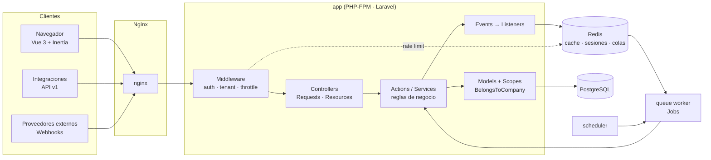
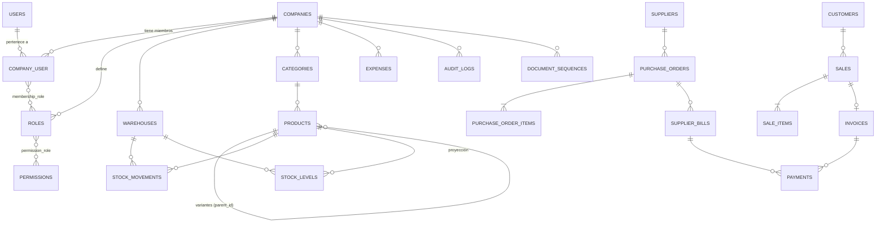

# EnterpriseFlow ERP — Arquitectura

> Documento vivo. Registra las decisiones técnicas y su justificación (estilo ADR ligero).
> Cada módulo nuevo añade o ajusta su sección aquí.

## 1. Visión general

EnterpriseFlow es un **monolito modular** Laravel que sirve dos interfaces sobre el mismo núcleo de dominio:

- **Web** (Inertia + Vue 3 + TypeScript): sesión con cookie, CSRF, SPA sin API pública.
- **API REST `/api/v1`** (Sanctum tokens): integraciones, apps móviles, automatizaciones.

Ambas interfaces son *adaptadores* delgados: validan la entrada (Form Requests), autorizan (Policies) y delegan en **Actions/Services**, que son las únicas que modifican estado de negocio.



## 2. Capas y responsabilidades

```text
app/
├── Actions/         Casos de uso atómicos (CreateSale, ReceivePurchaseOrder…). Una clase = una operación.
├── DTOs/            Datos de entrada tipados para Actions cuando un array no es suficientemente explícito.
├── Enums/           Estados y tipos (SaleStatus, StockMovementType, Permission…). Encapsulan transiciones válidas.
├── Events/          Hechos de dominio ya ocurridos (SaleConfirmed, StockBelowMinimum…).
├── Exceptions/      Excepciones de dominio (InsufficientStock, InvalidStateTransition…) → mapeadas a HTTP.
├── Http/
│   ├── Controllers/ Web/ (Inertia) y Api/V1/. Sin lógica de negocio.
│   ├── Middleware/  ResolveCurrentCompany, EnsureCompanyMember…
│   ├── Requests/    Validación + reglas tenant-aware.
│   └── Resources/   Serialización JSON estable para la API.
├── Jobs/            Trabajo asíncrono (PDF, reportes, emails, webhooks).
├── Listeners/       Reacciones a eventos (notificar, auditar, encolar).
├── Models/          Eloquent: relaciones, casts, scopes. Sin orquestación.
├── Notifications/   Canales database + mail.
├── Policies/        Autorización por modelo, siempre evaluada en backend.
├── Services/        Servicios reutilizables con estado o colaboradores (InventoryService, DocumentNumberGenerator…).
└── Support/         Infraestructura transversal (Tenancy/, Money/, Audit/, Api/…).
```

**Regla de oro:** un controlador hace `authorize → validate → action → respond`. Si un método de controlador supera ~15 líneas, falta una Action.

**Actions vs Services:** una *Action* es un caso de uso invocable (`handle()`), normalmente transaccional. Un *Service* agrupa operaciones de un subdominio que varias Actions reutilizan (p. ej. `InventoryService::move()` lo usan compras, ventas, devoluciones y ajustes).

## 3. Multi-tenancy

### 3.1 Estrategia: base de datos compartida con `company_id`

| Opción | Aislamiento | Coste operativo | Consultas cross-tenant (Super Admin, métricas) |
|---|---|---|---|
| **BD compartida + `company_id`** ✅ | Lógico (app + FKs) | Bajo: 1 esquema, 1 migración | Triviales |
| Esquema por tenant (PG schemas) | Medio | Migraciones × N | Complejas |
| BD por tenant | Fuerte | Alto (conexiones, backups × N) | Muy complejas |

Se elige BD compartida por simplicidad operativa, con **tres capas de defensa**:

1. **Global scope** (`BelongsToCompany` → `CompanyScope`): toda consulta Eloquent sobre un modelo tenant se filtra por la empresa activa, y `company_id` se asigna automáticamente al crear. Si no hay empresa activa en un contexto que la requiere, se lanza `MissingTenantContext` (fail-closed, nunca "devolver todo").
2. **Validación tenant-aware**: las reglas `exists`/`unique` de los Form Requests se restringen a la empresa activa, de modo que un ID de otra empresa se trata como inexistente (422/404, nunca 403 que revelaría existencia).
3. **Integridad en base de datos**: las relaciones entre entidades tenant usan **FKs compuestas** `(company_id, x_id) → x(company_id, id)`. Aunque un bug evitara las capas 1 y 2, PostgreSQL rechazaría una venta de la empresa A que apunte a un cliente de la empresa B.

### 3.2 Contexto de tenant

- `App\Support\Tenancy\TenantContext` — singleton por request/job con la empresa activa.
- **Web:** la empresa activa se guarda en sesión (`current_company_id`) y se cambia con un selector; el middleware verifica en cada request que el usuario siga siendo miembro activo.
- **API:** header `X-Company-Id` (o empresa por defecto del usuario); misma verificación de membresía.
- **Jobs:** los jobs tenant-aware serializan el `company_id` y restauran el contexto en `handle()` (trait `TenantAware`), porque el worker no tiene sesión.
- **Scheduler/CLI:** itera empresas explícitamente con `TenantContext::run($company, fn () => …)`.

### 3.3 Evolución a BD por tenant

`TenantContext` es el único punto que sabe *cuál* es la empresa activa. Para pasar a BD por tenant bastaría con: (a) un `TenantConnectionResolver` que cambie la conexión por defecto en `TenantContext::set()`, (b) mover las tablas tenant a una conexión `tenant`. Los IDs ULID de las entidades raíz evitan colisiones al separar/fusionar bases.

## 4. Identidad, roles y permisos

- **Super Admin:** flag de plataforma `users.is_super_admin`. No pertenece a empresas; `Gate::before` le concede acceso administrativo global. Nunca se asigna desde la UI de una empresa.
- **Membresía:** `company_user` (usuario ↔ empresa, con estado `active|suspended`). Un usuario puede pertenecer a varias empresas con roles distintos en cada una.
- **Roles por empresa:** cada empresa recibe al crearse copias de los roles del sistema (Owner, Administrator, Manager, Accountant, Sales, Warehouse, Employee) y puede ajustarlos. `roles.company_id` + `unique(company_id, slug)`.
- **Permisos granulares:** fuente de verdad en el enum `App\Enums\Permission` (`products.view`, `sales.cancel`…), sincronizados a tabla `permissions`.
- **Evaluación:** `$user->hasPermissionTo(Permission::SalesCancel)` consulta los permisos del usuario **en la empresa activa**, resueltos una vez por request y cacheados en memoria. Las Policies combinan permiso + pertenencia del recurso a la empresa + reglas de estado (p. ej. no cancelar una venta pagada).
- El frontend recibe la lista de permisos solo para **ocultar** UI; nunca es fuente de autorización.

**¿Por qué no `spatie/laravel-permission`?** Es excelente, pero su modo *teams* añade complejidad de configuración, y el modelo aquí es pequeño (~5 tablas, ~150 líneas). Implementarlo permite controlar el cache por tenant y las FKs compuestas. Se reconsiderará si aparecen permisos directos por usuario o jerarquías de roles.

## 5. Modelo de datos

Convenciones:
- **ULID** como PK en entidades raíz expuestas por URL/API (`companies`, `products`, `customers`, `suppliers`, `warehouses`, `sales`, `purchase_orders`, `invoices`, `payments`, `expenses`): no enumerables, ordenables por tiempo y seguros para una futura separación de bases.
- **bigint** en tablas internas de alto volumen (líneas, movimientos, auditoría, pivotes) y en `users`.
- **Dinero:** `bigint` en unidades menores (centavos) + cast `Money`. Nunca `float`. La moneda es la de la empresa.
- **Impuestos:** en *basis points* (`1900` = 19 %).
- **Cantidades:** `integer` (unidades). Unidades fraccionarias (kg, m) quedan en el roadmap.
- **Soft deletes** solo en catálogos (productos, clientes, proveedores, almacenes, categorías). Los documentos financieros **no se borran**: se cancelan/anulan con motivo.



Tablas de soporte: `document_sequences` (numeración sin huecos por empresa y tipo), `invitations`, `audit_logs`, `webhook_events`, `report_exports` (estado de exportaciones asíncronas), `notifications`, `jobs`, `failed_jobs`, `personal_access_tokens`.

## 6. Inventario basado en movimientos

- `stock_movements` es un **ledger append-only**: nunca se actualiza ni borra. Cada fila registra producto, almacén, cantidad con signo, tipo, costo unitario, usuario, referencia polimórfica (venta, compra, ajuste…), fecha y observaciones.
- `stock_levels(product_id, warehouse_id, quantity)` es una **proyección** para lecturas rápidas, actualizada *en la misma transacción* que el movimiento.
- Concurrencia: la fila de `stock_levels` se bloquea con `SELECT … FOR UPDATE` antes de validar disponibilidad → dos ventas simultáneas no pueden sobrevender.
- `php artisan inventory:rebuild` reconstruye la proyección desde el ledger y reporta discrepancias (demuestra que el stock es derivable).
- Una transferencia genera dos movimientos (salida + entrada) enlazados por un `transfer_id`.

## 7. Flujos transaccionales

Toda operación que toca más de una tabla de negocio corre en `DB::transaction()` dentro de su Action. Los efectos secundarios (emails, notificaciones, PDFs) se disparan con eventos **después del commit** (`ShouldDispatchAfterCommit` / `afterCommit()`), para no notificar algo que se revirtió.

- **Compra:** `draft → pending → approved → partially_received → received` (o `cancelled`). La recepción genera movimientos `purchase` y actualiza cantidades recibidas por línea.
- **Venta:** `draft → pending → confirmed → partially_paid → paid` (o `cancelled`). La confirmación valida y descuenta stock; la cancelación de una venta confirmada genera movimientos `return` compensatorios (el ledger nunca se reescribe).
- Las transiciones válidas viven en los Enums (`SaleStatus::canTransitionTo()`); una transición inválida lanza `InvalidStateTransition`.

## 8. Auditoría

Trait `Auditable` en modelos sensibles → registra `created/updated/deleted/restored` con valores anteriores y nuevos (solo campos cambiados, excluyendo secretos), usuario, empresa, IP, user agent y URL. Acciones de dominio relevantes (cancelar venta, anular pago, cambiar roles) registran eventos explícitos. Además, los eventos de seguridad (login fallido, cambio de roles, cambio de empresa) se escriben en el canal de log `security`.

## 9. Asíncrono: colas, scheduler y webhooks

- **Redis** como backend de colas con colas separadas: `default`, `notifications`, `reports`, `webhooks`.
- Exportaciones/PDFs: el request crea un `report_exports` en estado `pending`, encola el Job y la UI consulta el estado (`processing → completed|failed`).
- **Scheduler:** facturas vencidas, stock bajo, recordatorios, poda de sesiones/tokens, reportes periódicos.
- **Webhooks entrantes:** verificación HMAC con comparación en tiempo constante y ventana de timestamp → persistencia en `webhook_events` con `unique(provider, external_id)` (idempotencia garantizada por la BD) → respuesta `202` inmediata → procesamiento en Job con reintentos y backoff.

## 10. API

- Versionada por prefijo `/api/v1`, controladores en `Http/Controllers/Api/V1`.
- Envoltorio uniforme `{ success, data, message, meta? }` y errores `{ success: false, message, errors }` mediante un renderer central de excepciones para rutas `api/*`.
- Paginación, filtros, búsqueda y ordenación por *allow-list* (nunca columnas arbitrarias del cliente).
- Rate limiting por usuario/token y por IP en autenticación.
- Especificación OpenAPI generada desde el código (se evaluará `dedoc/scramble` en la fase de API).

## 11. Observabilidad

- Canales de log: `app_json` (aplicación), `queue` (jobs), `security` (auth/autorización/auditoría) — JSON por línea con contexto (`company_id`, `user_id`, `request_id`).
- `GET /health` comprueba aplicación, base de datos y Redis y devuelve `200` o `503` con detalle por componente.

## 12. Entornos y verificación

| Entorno | Base de datos | Cache/colas | Uso |
|---|---|---|---|
| Docker Compose | PostgreSQL 16 | Redis 7 | Desarrollo y demo |
| Tests locales | SQLite en memoria | array / sync | Feedback rápido |
| CI (GitHub Actions) | PostgreSQL 16 (service) | Redis 7 (service) | Garantiza compatibilidad con producción |

El código evita SQL específico de un motor salvo donde se justifica (p. ej. `lockForUpdate`, que en SQLite es un no-op seguro porque SQLite serializa escrituras).

## 13. Dependencias externas

Se añade una librería solo cuando Laravel no cubre la necesidad:

| Paquete | Motivo |
|---|---|
| `laravel/sanctum` | Tokens de API y SPA auth (first-party). |
| `pestphp/pest` | Tests más expresivos sobre PHPUnit. |
| `larastan/larastan` | Análisis estático consciente de Eloquent. |
| *(fase facturación)* `barryvdh/laravel-dompdf` | Laravel no genera PDF. |
| *(fase reportes)* `openspout/openspout` | XLSX en streaming con poca memoria; CSV se hace nativo. |
| *(fase API)* `dedoc/scramble` | OpenAPI inferido del código, sin anotaciones duplicadas. |

## 14. Plan incremental

1. ✅ Arquitectura y fundaciones (este documento, tooling, logging)
2. Base de datos núcleo + multi-tenancy
3. Autenticación (sesiones, invitaciones, desactivación)
4. Roles y permisos
5. Productos, categorías, variantes, almacenes
6. Inventario (ledger + proyección)
7. Compras
8. Ventas
9. Facturación (PDF)
10. Pagos
11. Gastos y reportes
12. Auditoría
13. API v1 + OpenAPI
14. Jobs/colas, notificaciones, scheduler, webhooks
15. Docker, CI/CD, documentación final
