# Base de datos (PostgreSQL 16)

EnterpriseFlow usa **PostgreSQL 16** como motor principal: es el que corre en Docker, en CI (toda la suite de tests se ejecuta sobre PostgreSQL) y en producción. SQLite solo se usa como atajo para ejecutar los tests en local más rápido.

Todas las imágenes de este documento se generaron ejecutando las consultas **sobre la base real de la demo** (`php artisan db:seed`): los resultados no están escritos a mano. Los diagramas se construyeron leyendo las claves foráneas del esquema, así que siempre reflejan las migraciones.

## Contenido

- [Visión general del modelo](#visión-general-del-modelo)
- [Diagramas entidad-relación](#diagramas-entidad-relación)
- [Decisiones de diseño](#decisiones-de-diseño)
- [Consultas de ejemplo](#consultas-de-ejemplo)
- [Cómo reproducir las consultas](#cómo-reproducir-las-consultas)

## Visión general del modelo

43 tablas organizadas por dominio. Todas las tablas de negocio llevan `company_id`: varias empresas comparten la misma base de datos, pero cada una solo ve sus datos.

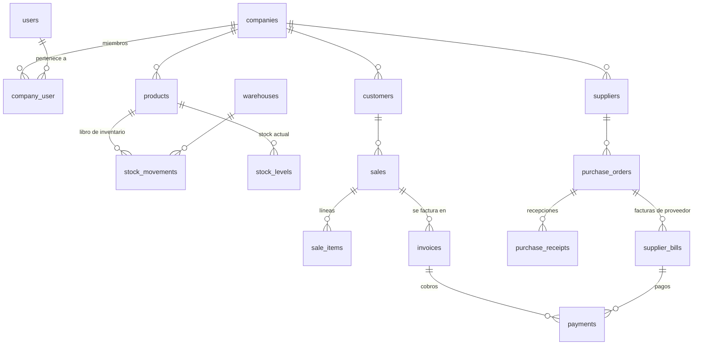

| Dominio | Tablas principales |
|---|---|
| Núcleo | `companies`, `users`, `company_user` (membresías), `roles`, `role_permissions`, `invitations` |
| Catálogo e inventario | `products`, `categories`, `warehouses`, `stock_movements` (libro), `stock_levels` (proyección) |
| Ventas y facturación | `customers`, `sales`, `sale_items`, `invoices`, `invoice_items`, `payments` |
| Compras | `suppliers`, `purchase_orders`, `purchase_order_items`, `purchase_receipts`, `supplier_bills` |
| Transversales | `audit_logs`, `notifications`, `document_sequences`, `report_exports`, `webhook_events`, `jobs` |

## Diagramas entidad-relación

Cada diagrama muestra las claves primarias (PK), las foráneas (FK) y las columnas más relevantes. El código Mermaid de cada uno está en [`docs/database/`](database/) (archivos `.mmd`).

### Núcleo: empresas, usuarios, roles e invitaciones
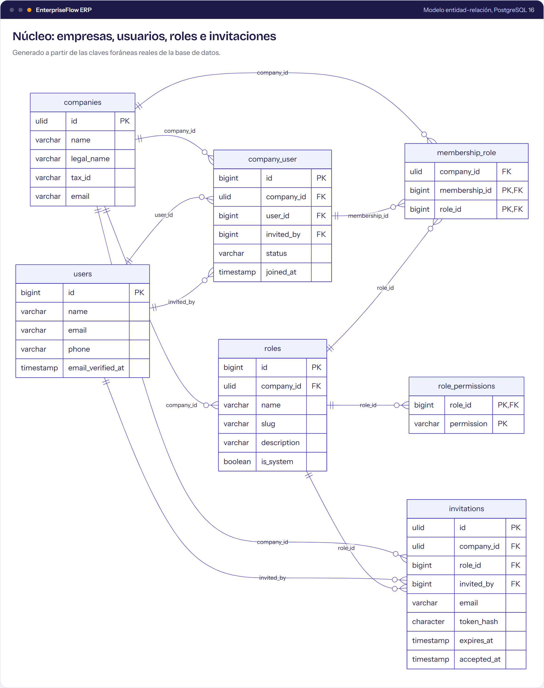

### Catálogo e inventario
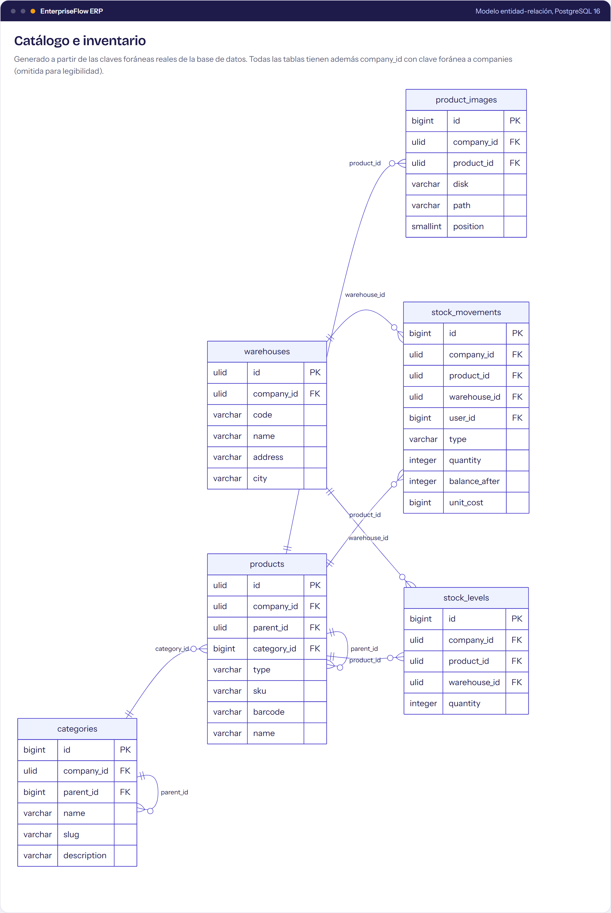

### Ventas, facturación y cobros
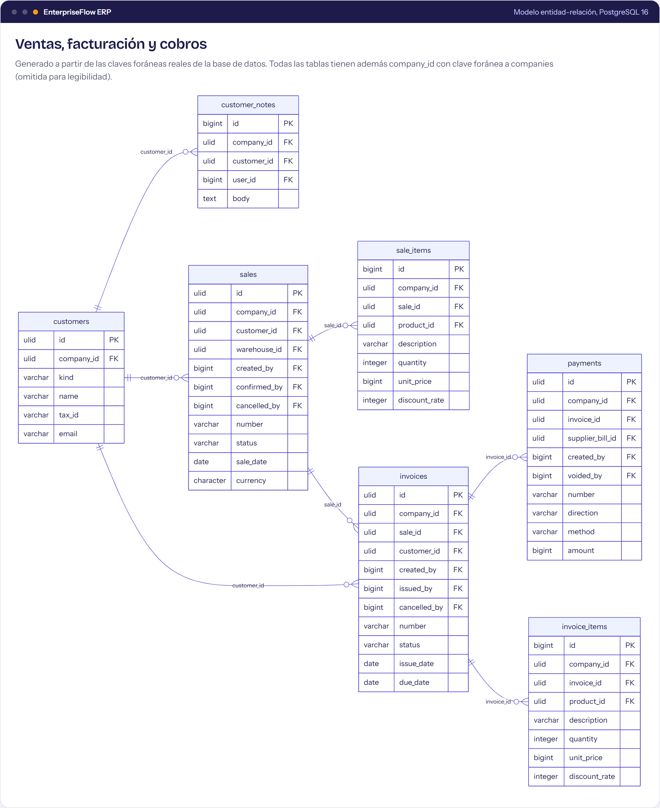

### Compras y cuentas por pagar
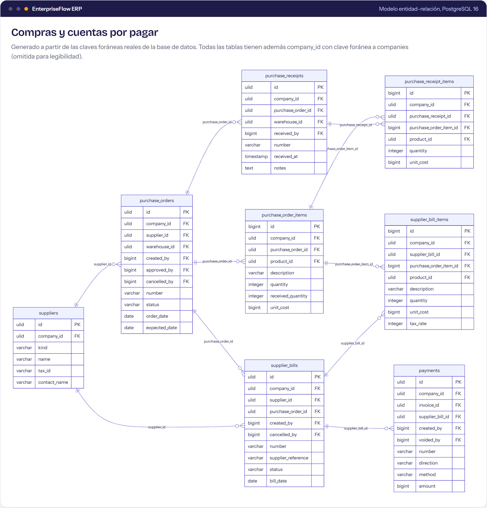

## Decisiones de diseño

| Decisión | Por qué |
|---|---|
| **Claves ULID** (`char(26)`) en las entidades expuestas por URL | No se pueden adivinar ni enumerar (`/sales/1`, `/sales/2`...) y se ordenan por fecha de creación. |
| **`company_id` en todas las tablas de negocio** | Aislamiento multiempresa en una sola base. La aplicación añade el filtro automáticamente y falla si no hay empresa activa. |
| **Claves foráneas compuestas `(company_id, id)`** | La base de datos impide relacionar registros de empresas distintas, aunque hubiera un error en el código. |
| **Dinero en enteros** (`bigint`, centavos) | Sin errores de redondeo de los decimales en coma flotante. Los porcentajes se guardan en puntos básicos (1900 = 19 %). |
| **Libro de inventario solo de inserción** | `stock_movements` guarda cada entrada y salida con el saldo resultante; un **trigger** rechaza `UPDATE` y `DELETE`. `stock_levels` es una proyección que se puede reconstruir. |
| **Auditoría inmutable** | `audit_logs` también está protegida por trigger: nadie puede borrar el rastro de un cambio. |
| **Numeración sin huecos** | `document_sequences` asigna SO-000001, INV-000001... por empresa, con bloqueo de fila. |
| **Índices únicos parciales** | Por ejemplo, una venta solo puede tener **una** factura activa: `UNIQUE (company_id, sale_id) WHERE status <> 'cancelled'`. |
| **Índices compuestos que empiezan por `company_id`** | Todas las consultas filtran por empresa; el índice `(company_id, status, sale_date)` resuelve los listados sin leer la tabla entera. |

## Consultas de ejemplo

Los archivos SQL están en [`docs/database/queries/`](database/queries/) y se pueden ejecutar tal cual.

### 1. Ventas por mes
[`01-ventas-por-mes.sql`](database/queries/01-ventas-por-mes.sql): agregación por mes con `date_trunc`, total y ticket promedio.

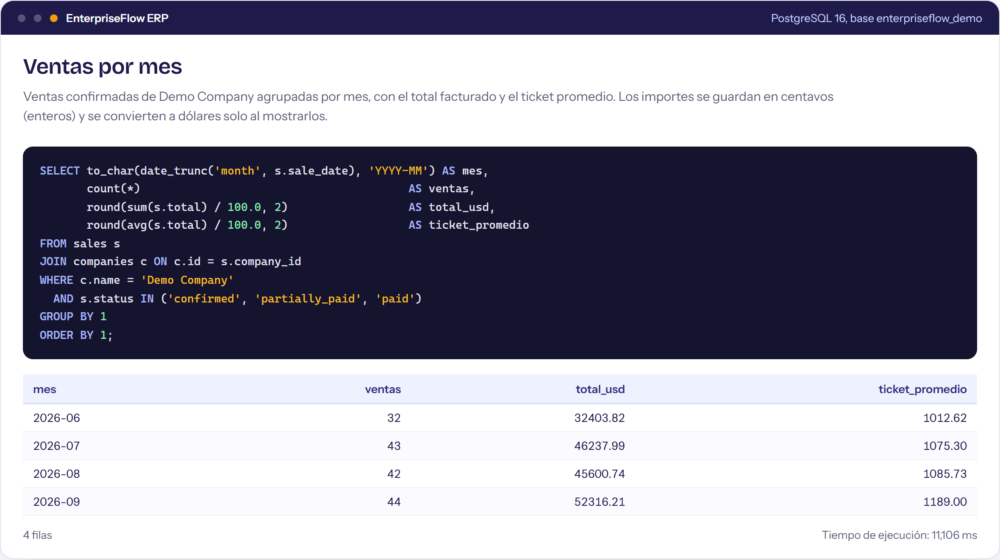

### 2. Productos con más ingresos y su margen
[`02-top-productos.sql`](database/queries/02-top-productos.sql): el margen usa el costo guardado en cada línea al confirmar la venta, no el costo actual.

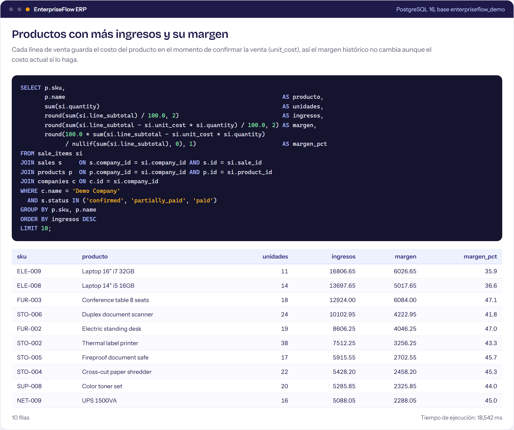

### 3. Antigüedad de cuentas por cobrar
[`03-cuentas-por-cobrar.sql`](database/queries/03-cuentas-por-cobrar.sql): tramos de vencimiento con la cláusula `FILTER` de PostgreSQL.

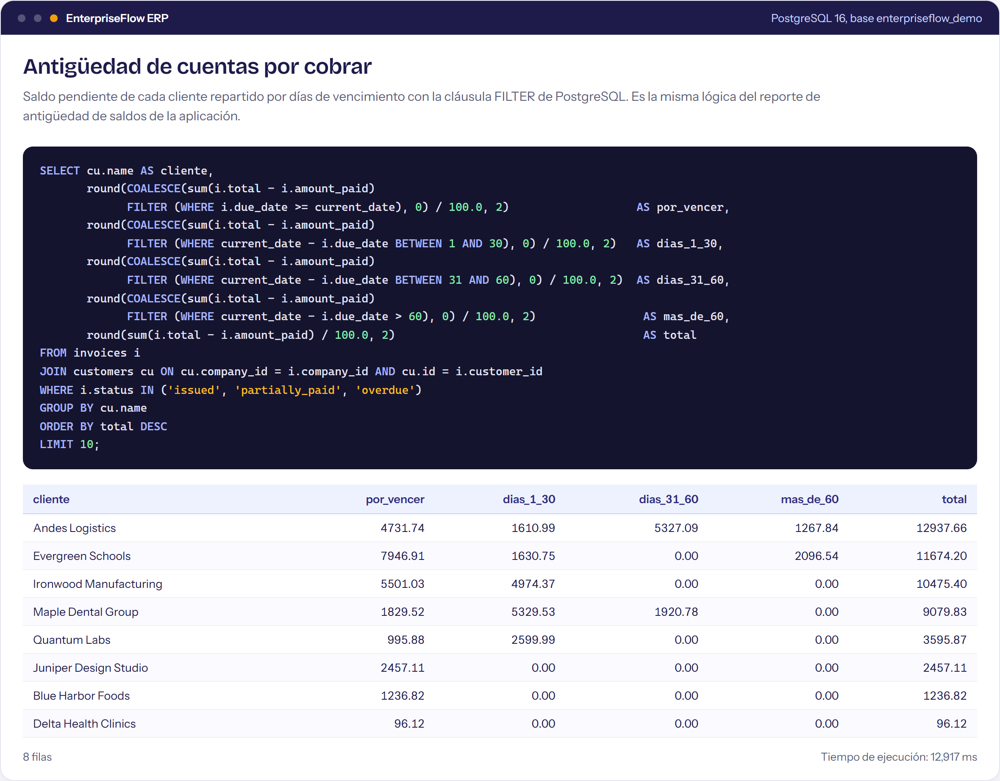

### 4. Libro de inventario de un producto
[`04-libro-de-inventario.sql`](database/queries/04-libro-de-inventario.sql): una función de ventana (`SUM() OVER`) recalcula el saldo y coincide con `balance_after` en cada movimiento.

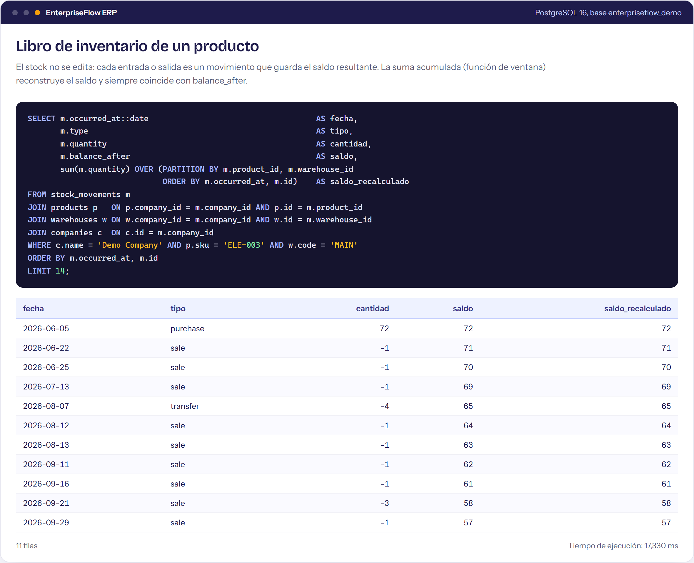

### 5. Aislamiento multiempresa
[`05-aislamiento-multiempresa.sql`](database/queries/05-aislamiento-multiempresa.sql): las dos empresas de la demo, con monedas distintas, en la misma base.

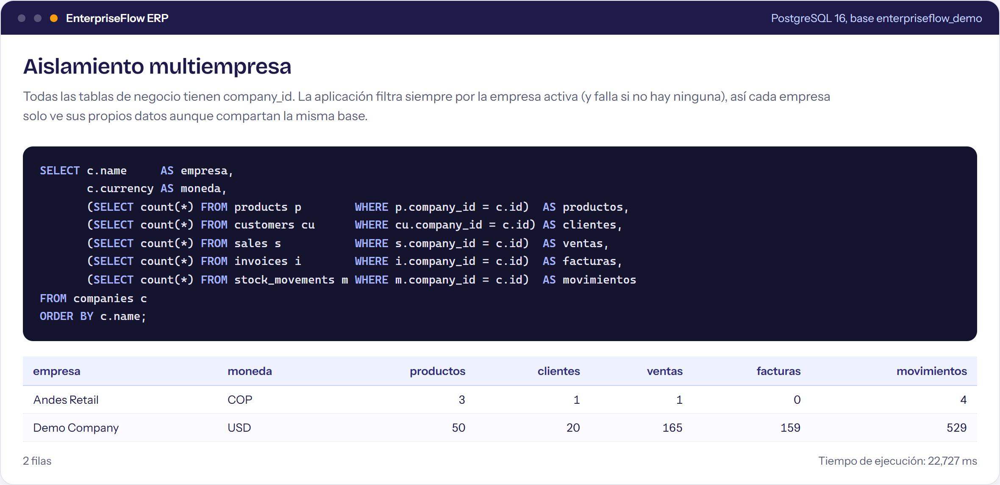

### 6. Claves foráneas compuestas
[`06-claves-compuestas.sql`](database/queries/06-claves-compuestas.sql): las restricciones reales leídas del catálogo de PostgreSQL.

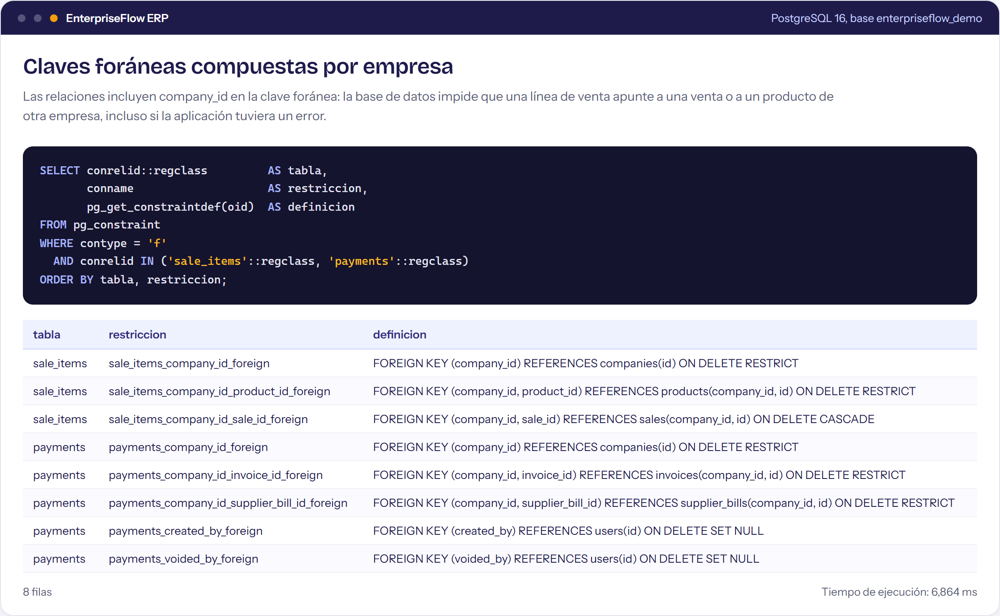

### 7. El libro de inventario no se puede modificar
[`07-trigger-solo-insercion.sql`](database/queries/07-trigger-solo-insercion.sql): el trigger rechaza la modificación con un error de la base de datos.

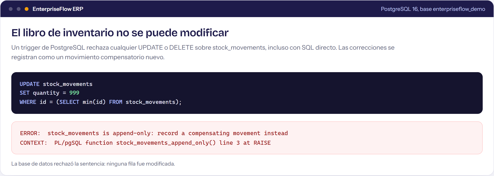

### 8. Auditoría de cambios
[`08-auditoria.sql`](database/queries/08-auditoria.sql): quién cambió qué y qué campos, leyendo el JSON de cada cambio.

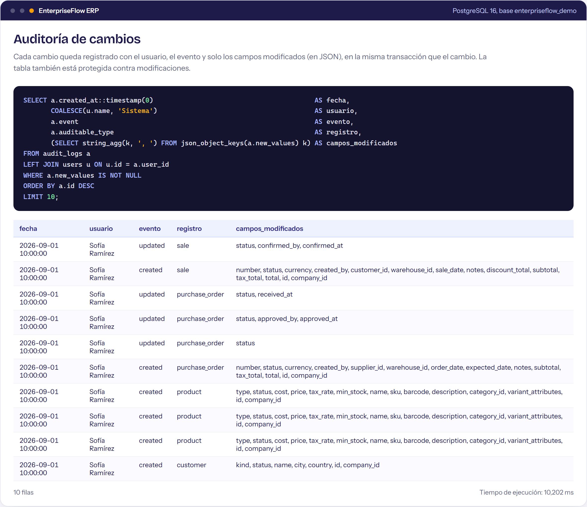

### 9. Plan de ejecución
[`09-plan-de-ejecucion.sql`](database/queries/09-plan-de-ejecucion.sql): `EXPLAIN ANALYZE` muestra que el listado usa el índice compuesto.

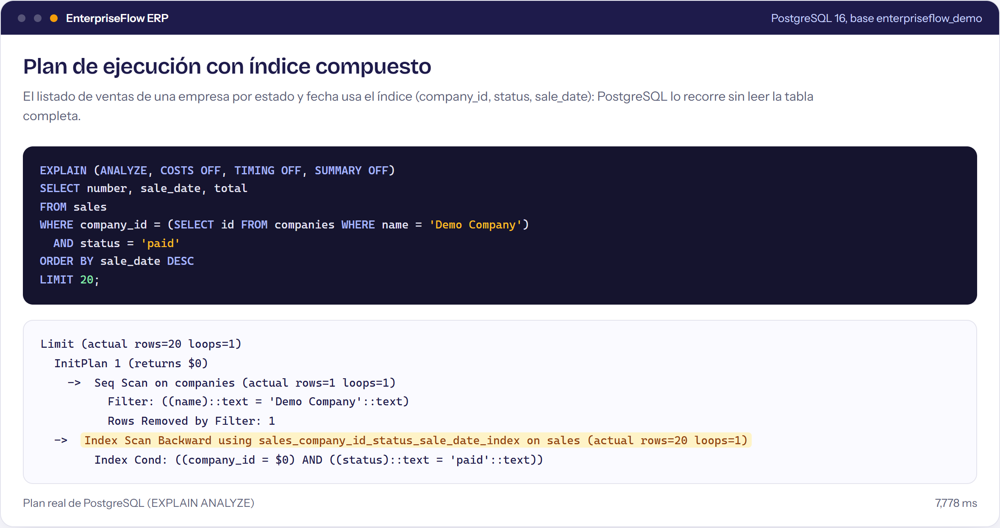

### 10. Tablas con más datos
[`10-tablas.sql`](database/queries/10-tablas.sql): estadísticas del propio PostgreSQL (`pg_stat_user_tables`).

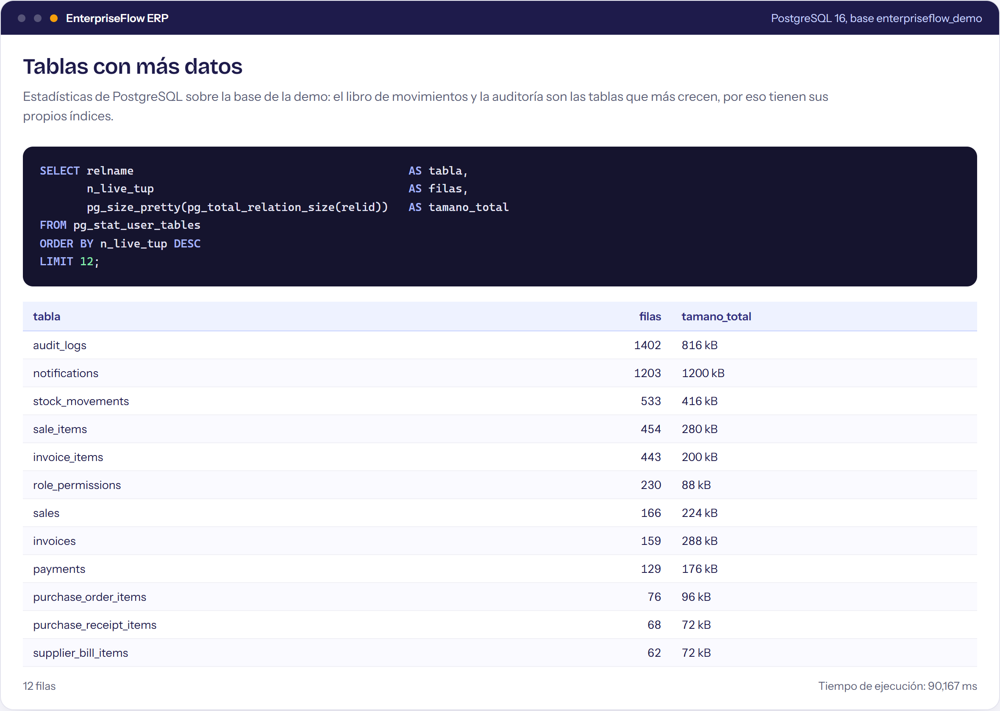

## Cómo reproducir las consultas

Con el stack de Docker levantado (`docker compose up -d`), la demo se carga sola. Para abrir una consola de PostgreSQL:

```bash
docker compose exec postgres psql -U enterpriseflow -d enterpriseflow
```

Y para ejecutar un archivo de consulta:

```bash
docker compose exec -T postgres psql -U enterpriseflow -d enterpriseflow < docs/database/queries/01-ventas-por-mes.sql
```

La base también es accesible desde una herramienta gráfica (DBeaver, TablePlus, pgAdmin) en `127.0.0.1:5432`, usuario `enterpriseflow`, contraseña la de `DB_PASSWORD` en `.env`.
